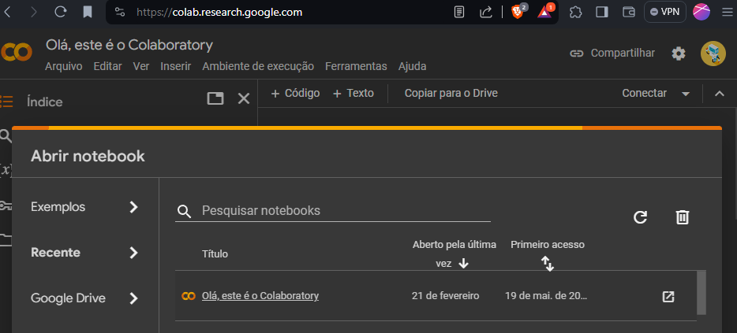
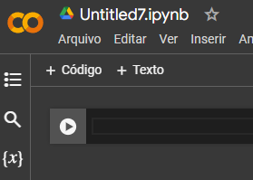

# Ambientes **Interativos** de Análise de Dados

> Um ambiente interativo de análise de dados é uma ferramenta que permite aos usuários explorar, manipular e visualizar dados de forma interativa. 

<!-- _backgroundImage: url('bg/light_keyboard.jpg') -->
<!-- _footer: "" -->


---
# Exemplos de Ambientes

- **Jupyter Notebooks**
  - Aplicação web de código aberto para criar documentos que contenham código executável, equações, visualizações e texto explicativo.


- **RStudio**
  - Ambiente de desenvolvimento integrado (IDE) para a linguagem de programação R, com recursos avançados para análise de dados e geração de relatórios.


---

- **Microsoft Azure Notebooks**
  - Serviço baseado em nuvem que permite criar e executar notebooks Jupyter diretamente no navegador, com recursos poderosos de análise de dados e machine learning.

- **IBM Watson Studio**
  - Plataforma de ciência de dados e aprendizado de máquina na nuvem, oferecendo ferramentas para explorar, preparar e analisar dados, além de desenvolver modelos de machine learning.


---

- **Google Colab**
   - Serviço gratuito baseado na nuvem que oferece notebooks Jupyter hospedados no Google Drive, com acesso a recursos de hardware acelerados, como GPUs, para treinamento de modelos de aprendizado profundo.


> Neste curso, utilizaremos o **Google Colab** para executar códigos Python e realizar análises de dados.
> 
---

# Google Colab: Uma Visão Geral

- Ambiente de desenvolvimento baseado em **nuvem** para **Python**
- Integração com o **Google Drive**
- Suporte para execução de código em Python
- GPUs e TPUs disponíveis para aceleração de computação

---

## Vantagens do Google Colab

- Acesso gratuito e fácil
- Armazenamento e compartilhamento de notebooks via Google Drive
- Grande variedade de bibliotecas Python disponíveis
- Utilização de hardware acelerado para análises mais rápidas
- Não depende de instalação local de software

---

## Desvantagens do Google Colab

- Limitações de recursos computacionais (versão gratuita)
  - Memória RAM limitada (13 GB)
  - Tempo de execução limitado (12 horas)
  - Armazenamento temporário (69 GB)
- Dependência de conexão com a internet

---

# Tutorial Google Colab

## Passo 1: Acessando o Google Colab

- Acesse [colab.research.google.com](https://colab.research.google.com/)
- Faça login com sua **conta Google**, se necessário



---

## Passo 2: Criando um Novo Notebook

- Clique em "Novo Notebook" ou acesse "Arquivo" > "Novo Notebook"

## Passo 3: Executando Código

- Conecte-se a um ambiente de execução clicando em "Conectar"
- **Células de texto**: adicione texto formatado usando **Markdown**
- **Células de código**: escreva e execute código **Python**

> Obs.: É possível utilizar outras linguagens de programação, como R e Scala, no Google Colab.



---

## Passo 4: Adicionando Texto Formatado

- Clique em `+` para adicionar uma nova célula
- Selecione o tipo de célula desejado: **Texto** ou **Código**
- Use a sintaxe ***Markdown*** para formatar o texto
- Pressione `Shift + Enter` para renderizar a célula

> Abordaremos com detalhes a sintaxe *Markdown* no próximo módulo.

---

## Passo 5: Executando Código Python

- Pressione `conectar` para conectar-se a um ambiente de execução
- Escreva o código Python na célula de código
- Pressione `Shift + Enter` para executar o código
- O resultado da execução será exibido abaixo da célula
- Variáveis e funções definidas em células anteriores podem ser usadas em células posteriores
- O ambiente de execução é mantido entre as células

> Obs.: Os **resultados** de saída, como gráficos e tabelas, são **salvos** no notebook e podem ser visualizados posteriormente **sem** a necessidade de **reexecução do código**.


---

## Passo 6: *Upload* de Arquivos


- Faça *upload* de arquivos para o *Google Colab* clicando no ícone de pasta
- Selecione o arquivo desejado no seu computador
- O arquivo será carregado e estará disponível para uso no notebook


---

## Passo 7: Obtendo Arquivos do Google Drive via Código

- Obtenha um link para compartilhamento do arquivo no Google Drive (com permissão de leitura)
- Extraia o ID do arquivo do link. 
  - Exemplo: `https://drive.google.com/file/d/1aBcDeFgHijKlmNoPqRsTuVwXyZ/view`
  - ID do arquivo: `1aBcDeFgHijKlmNoPqRsTuVwXyZ`
- Use o código abaixo para carregar o arquivo no Google Colab:

```python
!gdown --id '1aBcDeFgHijKlmNoPqRsTuVwXyZ'
```

---

## Considerações

- Os arquivos **criados** no *Google Colab* são salvos automaticamente no Google Drive
- Os arquivos **carregados** para o *Google Colab* são armazenados **temporariamente**
- É possível compartilhar notebooks com outras pessoas, permitindo colaboração em tempo real
- O *Google Colab* oferece suporte a bibliotecas populares de Python, como NumPy, Pandas, Matplotlib, TensorFlow e PyTorch
- Os arquivos de dados podem ser carregados diretamente do Google Drive ou de outras fontes
- Os notebooks podem ser baixados e **executados localmente** em um ambiente Jupyter Notebook

---

## Atalhos Úteis
- Executar células:
  - `Ctrl+Enter`: Executar a célula
  - `Shift+Enter`: Executar a célula e avançar para a próxima
  - `Alt+Enter`: Executar a célula e adicionar uma nova abaixo  
- Outros atalhos: pressione `Ctrl+M` para entrar no modo de atalho e, em seguida, pressione a tecla de atalho desejada
  - `Ctrl+M+H`: Exibir lista de atalhos
  - `Ctrl+M+A`, `Ctrl+M+B`: Adicionar nova célula acima/abaixo
  - `Ctrl+M+D`: Excluir célula selecionada
  - `Ctrl+M+Y`: Alterar tipo de célula para código
  - `Ctrl+M+M`: Alterar tipo de célula para texto

---

# Conclusão

- O *Google Colab* é uma ferramenta poderosa para análise de dados baseada em **nuvem**, oferecendo acesso **gratuito** e **fácil**, suporte para execução de código Python e integração com o *Google Drive*. 

---

# Exercícios de Fixação

1. Acesse o *Google Colab* e crie um novo notebook. Adicione uma célula de texto e uma célula de código, e execute um código Python simples.
  
 
