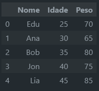

 # <!--fit--> Pandas
Conceitos e Elementos Básicos


---


# Introdução

#### História e Contexto do Pandas
Pandas, abreviação de "Python Data Analysis Library," foi criado por Wes McKinney em 2008. Foi desenvolvido para fornecer ferramentas de análise e manipulação de dados semelhantes às encontradas em **R** e **Excel**, mas construídas sobre a linguagem de programação **Python**.

[Pandas](https://pandas.pydata.org)

[Python for Data Analysis](https://edisciplinas.usp.br/pluginfile.php/7880239/mod_folder/content/0/Wes%20McKinney%20-%20Python%20for%20Data%20Analysis_%20Data%20Wrangling%20with%20pandas%2C%20NumPy%2C%20and%20Jupyter-OReilly%20Media%20%282022%29.pdf)

---

#### Importância do Pandas na Ciência de Dados

- **Estruturas de Dados Flexíveis**: Essas estruturas permitem a manipulação eficiente e **intuitiva** de dados rotulados, **facilitando operações complexas de dados**.
- **Integração com Outras Bibliotecas**: Pandas é frequentemente usada em conjunto com outras bibliotecas de análise de dados, como NumPy, scipy, Matplotlib, entre outras.
- **Suporte a Diversos Formatos de Dados**: Pandas suporta a leitura e escrita de dados em diversos formatos, como CSV, Excel, SQL, JSON, HTML, entre outros.

---

- **Desempenho e Eficiência**: Se bem utilizada, Pandas pode ser uma ferramenta poderosa para manipulação de dados, haja vista suas operações internas otimizadas e vetorizadas.
- **Comunidade Ativa e Suporte**: Pandas é uma das bibliotecas mais populares para manipulação de dados em Python, com uma comunidade ativa e fóruns de suporte.
  
---

#### Pandas vs SQL

- **Pandas** é uma biblioteca de manipulação de dados em memória, enquanto **SQL** é uma linguagem de consulta a bancos de dados.
- Pandas é mais adequado para operações de **análise exploratória de dados** e **manipulação de dados em memória**, enquanto SQL é mais adequado para **consultas complexas em bancos de dados**.
- Pandas é mais **flexível** e **intuitivo** para operações de análise de dados, enquanto SQL é mais **eficiente** para consultas em bancos de dados.

---

# Estruturas de Dados Fundamentais

### Series

- **Objeto unidimensional** semelhante a um *array*
- **Rótulos de índice** para cada elemento
- dados **homogêneos** (mesmo tipo)

### DataFrames

- **Objeto bidimensional** semelhante a uma **tabela ou planilha**
- **Rótulos de índice** e **colunas** para cada elemento
- **coleção de Series**

> **Nota**: Há outras estruturas de dados no Pandas, mas Series e DataFrames são as mais comuns e amplamente utilizadas.
  
<!-- _footer: "" -->

---

## Importando a Biblioteca Pandas

```python
import pandas as pd
```
> `pd` é um apelido (*alias*)  para 'pandas' que é comumente utilizado na comunidade Python.


---

## Criando *Series*


### Usando Listas
```python
>>> s = pd.Series([1, 3, 5, np.nan, 6, 8])
>>> s
0    1.0
1    3.0
2    5.0
3    NaN
4    6.0
5    8.0
dtype: float64
```
> Note que o Pandas automaticamente atribui um índice para cada elemento da *Series* (0-5). E o tipo de dado é inferido automaticamente (`float64`).
> `dtype` é um atributo que retorna o tipo de dado da *Series*.
---
Designando um **índice** personalizado, **nome** e **tipo** de dado:
```python
s = pd.Series([25, 30, 35, 40, 45], 
...             index=['Edu', 'Ana', 'Bob', 'Jon', 'Lia'],
...             name='Idade', dtype='int64')
>>> s       
Edu    25
Ana    30
Bob    35
Jon    40
Lia    45
Name: Idade, dtype: int64
```

[documentação](https://pandas.pydata.org/pandas-docs/stable/reference/api/pandas.Series.html)


---

### Usando um *array* NumPy
```python
>>> data = np.array([25, 30, 35, 40, 45])
>>> s = pd.Series(data, copy=True)
```
> `copy` é um argumento que indica ao Pandas se deve fazer uma cópia dos dados. *default* é `copy=False`.
- Quando usamos um *array* NumPy para criar uma *Series*, por padrão, o Pandas não faz uma cópia dos dados, mas sim **referencia** o *array* original.
- Isso pode ser útil para **economizar memória** em grandes conjuntos de dados.
- Mas é importante ter **cuidado ao modificar o *array* original**, pois isso pode afetar a *Series*.

---

### Usando um Dicionário
```python
>>> data = {'Edu': 25, 'Ana': 30, 'Bob': 35, 'Jon': 40, 'Lia': 45}
>>> s = pd.Series(data)
>>> s
Edu    25
Ana    30
Bob    35
Jon    40
Lia    45
dtype: int64
```
> Quando usamos um dicionário para criar uma *Series*, as **chaves** do dicionário são automaticamente atribuídas como **rótulos de índice** da *Series*.

---

### Dica de performance

> Se seu  algoritmo precisa 'montar' uma *Series*, é **mais eficiente** criar um **dicionário** ou **lista** e depois transformá-lo em *Series*.

Execute o teste abaixo no *Colab*:
  
```python
%%timeit
s = pd.Series()
for i in range(10000):
    s.loc[i] = i
```
```python
%%timeit
d = []
for i in range(10000):
    d.append(i)
s = pd.Series(d)
```

---

## Iterando sobre uma Series

```python
>>> s = pd.Series([25, 30, 35, 40, 45], index=['Edu', 'Ana', 'Bob', 'Jon', 'Lia'])
>>> for key, value in s.items():
...     print(f'{key}: {value}')
Edu: 25
Ana: 30
Bob: 35
Jon: 40
Lia: 45
```
> O método `items()` retorna um iterador sobre os rótulos de índice e os valores da Series.

---
## Acessando Elementos de uma Series

### Por Índice
```python
>>> s = pd.Series([25, 30, 35, 40, 45], index=['Edu', 'Ana', 'Bob', 'Jon', 'Lia'])
>>> s[0]
25
```
### Por Rótulo de Índice
```python
>>> s['Edu']
25
```
> **Atenção**: As duas formas apresentadas acima são **ambíguas** e podem causar **confusão**. É recomendado usar `.iloc` para indexação **por posição** e `.loc` para indexação **por rótulo**.


---
#### Exemplo ambíguo
```python
>>> s = pd.Series([25, 30, 35, 40], index=[1, 2, 3, 4])
>>> s[3]
35
>>> s = pd.Series([25, 30, 35, 40])
>>> s[3]
40
```

> `s[3]` é o elemento com rótulo `3` ou o elemento na posição `3`? **Depende** do contexto. Por isso, é recomendado usar `.iloc` e `.loc` para evitar ambiguidades.

---

### Por Posição
```python
>>> s = pd.Series([25, 30, 35, 40, 45], index=['Edu', 'Ana', 'Bob', 'Jon', 'Lia'])
>>> s.iloc[0]
25
```

### Por Rótulo de Índice
```python
>>> s.loc['Edu']
25
```

---

### Dica de performance

- Tudo bem usar `.loc` e `.iloc` para acessar um elemento específico para depuração ou inspeção durante o desenvolvimento.
- O mesmo para `for k, v in s.items():`.
- Mas suas empregos **denunciam** o acesso elemento por elemento, o que é **ineficiente**.
- Procure sempre usar **operações vetorizadas** para acessar elementos de uma Series ou DataFrame.
- Exemplo:
```python
>>> a = pd.Series([1, 2, 3, 4, 5]) 
>>> x = all(a % 2 == 0) # Verifica se todos os elementos são pares
>>> x
False
```

---

### Modificando Elementos de uma Series

```python
>>> s = pd.Series([25, 30, 35, 40, 45], index=['Edu', 'Ana', 'Bob', 'Jon', 'Lia'])
>>> s.loc['Edu'] = 55
>>> s.iloc[1] = 77
>>> s
Edu    55
Ana    77
Bob    35
Jon    40
Lia    45
dtype: int64
```

---

- Quando atribuímos a uma **posição** (`.iloc`) que não existe, o Pandas retorna um `IndexError`.
```python
>>> s.iloc[5] = 100
IndexError: iloc cannot enlarge its target object
```
- Quando atribuímos a um **rótulo** (`.loc`) que não existe, o Pandas **adiciona** um novo elemento à Serie.
```python
>>> s.loc['Rau'] = 100
```

---

- Modificando mais de um elemento de uma vez:
```python
>>> s = pd.Series([25, 30, 35, 40, 45], index=['Edu', 'Ana', 'Bob', 'Jon', 'Lia'])
>>> s.loc[['Edu', 'Ana', 'Bob']] = 100
>>> s
Edu    100
Ana    100
Bob    100
Jon     40
Lia     45
dtype: int64
```

---

- Modificando elementos com base em uma condição:
```python
>>> s = pd.Series([25, 30, 35, 40, 45], index=['Edu', 'Ana', 'Bob', 'Jon', 'Lia'])
>>> s[s > 30] = 100
>>> s
Edu     25
Ana     30
Bob    100
Jon    100
Lia    100
dtype: int64
```

---

### Removendo Elementos de uma Series
#### Por Rótulo de Índice
```python
>>> s = pd.Series([25, 30, 35, 40, 45], index=['Edu', 'Ana', 'Bob', 'Jon', 'Lia'])
>>> s.drop('Edu', inplace=True)
>>> s
Ana    30
Bob    35
Jon    40
Lia    45
dtype: int64
```
> O método `drop()` remove um elemento da Series com base no rótulo de índice. O argumento `inplace=True` modifica a Series original.
> Se `inplace=False` (padrão), o método retorna uma **nova Series** sem o elemento removido.

---

#### Por Posição
```python
>>> s = pd.Series([25, 30, 35, 40, 45], index=['Edu', 'Ana', 'Bob', 'Jon', 'Lia'])
>>> s.drop(s.index[0], inplace=True)  # Remove o primeiro elemento
>>> s
Ana    30
Bob    35
Jon    40
Lia    45
dtype: int64
```
> `.index` retorna os rótulos de índice da Series. Assim, `s.index[0]` retorna o rótulo do primeiro elemento da Series.

---

#### Removendo Elementos por Condição
```python
>>> s = pd.Series([25, 30, 35, 40, 45], index=['Edu', 'Ana', 'Bob', 'Jon', 'Lia'])
>>> s = s[s > 30]  # Remove elementos menores ou iguais a 30
>>> s
Bob    35
Jon    40
Lia    45
dtype: int64
```

--- 

### *Slicing* em uma Series

#### Por Posição
```python
>>> s = pd.Series([25, 30, 35, 40, 45], index=['Edu', 'Ana', 'Bob', 'Jon', 'Lia'])
>>> s.iloc[1:3]
Ana    30
Bob    35
dtype: int64
```

#### Por Rótulo de Índice
```python
>>> s.loc['Ana':'Jon']
Ana    30
Bob    35
Jon    40
dtype: int64
```

> **Atenção**: O *slicing* por rótulo de índice é **inclusivo**.

---

### Concatenando Series

```python
>>> s1 = pd.Series([25, 30, 35], index=['Edu', 'Ana', 'Bob'])
>>> s2 = pd.Series([40, 45], index=['Jon', 'Lia'])
>>> s = pd.concat([s1, s2])
>>> s
Edu    25
Ana    30
Bob    35
Jon    40
Lia    45
dtype: int64
```
> Em caso de duplicidade de rótulos, o Pandas **mantém** os rótulos duplicados.

---

### Tratando rótulos duplicados

- Forçar a verificação de duplicidade de rótulos:
```python
>>> s1 = pd.Series([25, 30, 35], index=['Edu', 'Ana', 'Bob'])
>>> s2 = pd.Series([40, 45], index=['Bob', 'Ana'])
>>> s = pd.concat([s1, s2], verify_integrity=True)
ValueError: Index has duplicates
```
- Ignorar os rótulos dos elementos concatenados, novos rótulos numéricos são criados:
```python
>>> s = pd.concat([s1, s2], ignore_index=True)
```
- Concatenar com a diferença:
```python
>>> s2_minus_s1 = set(s2.index) - set(s1.index)
>>> s = pd.concat([s1, s2.loc[s2_minus_s1]])
```

---

## Ordenando uma Series

### Por Índice
```python
>>> s = pd.Series([25, 30, 35, 40, 45], index=['Edu', 'Ana', 'Bob', 'Jon', 'Lia'])
>>> s.sort_index(ascending=False, inplace=True)
```

> O método `sort_index()` ordena a Series com base nos rótulos de índice. O argumento `ascending=False` ordena em ordem decrescente.
> O argumento `inplace=True` **modifica** a Series original.
> Se `inplace=False` (padrão), o método **retorna** uma **nova Series** ordenada.

---

### Por Valor
```python
>>> s = pd.Series([25, 30, 35, 40, 45], index=['Edu', 'Ana', 'Bob', 'Jon', 'Lia'])
>>> s.sort_values(ascending=False, inplace=True)
```

---

## <!-- fit--> DataFrames


<!-- _footer: "" -->
---

### Criando DataFrames

#### Usando Listas
```python
>>> nomes = ['Edu', 'Ana', 'Bob', 'Jon', 'Lia']
>>> idades = [25, 30, 35, 40, 45]
>>> pesos = [70, 65, 80, 75, 85]
>>> cols = ['Nome', 'Idade', 'Peso']
>>> data = [nomes, idades, pesos]
>>> df = pd.DataFrame(data, index=cols).T
>>> df
  Nome Idade Peso
0  Edu    25   70
1  Ana    30   65
2  Bob    35   80
3  Jon    40   75
4  Lia    45   85
```
> O método `.T` transpõe o DataFrame, trocando linhas por colunas.

<!-- _footer: "" -->

---
Sem transpor o DataFrame:
```python
>>> rows = []
>>> rows.append(['Edu', 25, 70])
>>> rows.append(['Ana', 30, 65])
>>> rows.append(['Bob', 35, 80])
>>> rows.append(['Jon', 40, 75])
>>> rows.append(['Lia', 45, 85])
>>> cols = ['Nome', 'Idade', 'Peso']
>>> df = pd.DataFrame(rows, columns=cols)
>>> df
  Nome  Idade  Peso
0  Edu     25    70
1  Ana     30    65
2  Bob     35    80
3  Jon     40    75
4  Lia     45    85
```
---

#### Usando um Dicionário
```python
>>> data = {'Nome': ['Edu', 'Ana', 'Bob', 'Jon', 'Lia'],
...         'Idade': [25, 30, 35, 40, 45],
...         'Peso': [70, 65, 80, 75, 85]}
>>> df = pd.DataFrame(data)
>>> df
  Nome  Idade  Peso
0  Edu     25    70
1  Ana     30    65
2  Bob     35    80
3  Jon     40    75
4  Lia     45    85
```

---

#### Juntando Series

```python
>>> nomes = pd.Series(['Edu', 'Ana', 'Bob', 'Jon', 'Lia'], name='Nome')
>>> idades = pd.Series([25, 30, 35, 40, 45], name='Idade')
>>> pesos = pd.Series([70, 65, 80, 75, 85], name='Peso')
>>> df = pd.concat([nomes, idades, pesos], axis=1)
>>> df
  Nome  Idade  Peso
0  Edu     25    70
1  Ana     30    65
2  Bob     35    80
3  Jon     40    75
4  Lia     45    85
```

> O argumento `axis=1` indica que a concatenação deve ser feita ao longo das colunas.

---

#### Carregando um DataFrame de um arquivo CSV

```python
>>> df = pd.read_csv('data.csv')
```
> O método `read_csv()` carrega um arquivo CSV em um DataFrame. O arquivo deve estar no mesmo diretório do script Python ou o caminho completo deve ser fornecido.

[documentação](https://pandas.pydata.org/pandas-docs/stable/reference/api/pandas.read_csv.html)

---

#### Carregando um DataFrame de um arquivo Excel

```python
>>> df = pd.read_excel('data.xlsx')
```
> Pode ser necessário instalar a biblioteca `openpyxl` para ler arquivos Excel. O arquivo deve estar no mesmo diretório do script Python ou o caminho completo deve ser fornecido. No colab, execute `!pip install openpyxl`.

[documentação](https://pandas.pydata.org/pandas-docs/stable/reference/api/pandas.read_excel.html)

---

#### Carregando de um arquivo de campos de largura fixa

```python
>>> df = pd.read_fwf('data.txt', widths=[10, 10, 10])
```

[documentação](https://pandas.pydata.org/pandas-docs/stable/reference/api/
pandas.read_fwf.html)

#### Carregando de um arquivo JSON

```python
>>> df = pd.read_json('data.json')
```


[documentação](https://pandas.pydata.org/pandas-docs/stable/reference/api/pandas.read_json.html)

> Também é possível carregar arquivos SQL, HTML, entre outros formatos além de se conectar a bancos de dados SQL. Mas não abordaremos esses métodos neste curso.

---
## Atributos principais de um DataFrame

- `shape`: Retorna uma tupla com o número de linhas e colunas do DataFrame.
- `columns`: Retorna uma lista com os rótulos das colunas do DataFrame.
- `index`: Retorna uma lista com os rótulos das linhas do DataFrame.
- `dtypes`: Retorna uma Series com os tipos de dados das colunas do DataFrame.
- `values`: Retorna um *array* NumPy com os valores do DataFrame.
  
---

```python
>>> df = pd.DataFrame({'Nome': ['Edu', 'Ana', 'Bob', 'Jon', 'Lia'],
...                    'Idade': [25, 30, 35, 40, 45],
...                    'Peso': [70, 65, 80, 75, 85]})
>>> df.shape
(5, 3)
>>> df.columns
Index(['Nome', 'Idade', 'Peso'], dtype='object')
>>> df.index
RangeIndex(start=0, stop=5, step=1)
>>> df.dtypes
Nome     object
Idade     int64
Peso      int64
dtype: object
>>> df.values
array([['Edu', 25, 70],
       ['Ana', 30, 65],
       ['Bob', 35, 80],
       ['Jon', 40, 75],
       ['Lia', 45, 85]], dtype=object)
```


---

## Indexação e Seleção de Dados


<!-- _footer: "" -->

---

### Indexação Básica

Vamos usar o seguinte DataFrame como exemplo:

```python
>>> df = pd.DataFrame({'Nome': ['Edu', 'Ana', 'Bob', 'Jon', 'Lia'],
...                    'Idade': [25, 30, 35, 40, 45],
...                    'Peso': [70, 65, 80, 75, 85]})
```



---

####  Acessando por linha

Para acessar uma linha específica, usamos o método `.loc[]` com o rótulo da linha ou `.iloc[]` com a posição da linha.

```python
>>> df.loc[0]
Nome     Edu
Idade     25
Peso      70
Name: 0, dtype: object
```

> Naturalmente, *slice* é possível. Exemplo: `df.loc[1:3]`.
> Também é possível acessar várias linhas com uma lista de rótulos ou posições. Exemplo: `df.loc[[0, 2, 4]]`.


---

#### Acessando por coluna

Para acessar uma coluna específica, usamos o nome da coluna entre colchetes.

```python
>>> df['Nome']
0    Edu
1    Ana
2    Bob
3    Jon
4    Lia
Name: Nome, dtype: object
```


> Também é possível acessar várias colunas com uma lista de nomes. Exemplo: `df[['Nome', 'Peso']]`.

---

#### Acessando por coluna (alternativa)

Também podemos acessar uma coluna específica usando a **notação de ponto**.

```python
>>> df.Idade
0    25
1    30
2    35
3    40
4    45
Name: Idade, dtype: int64
```


---

#### Acessando por linha e coluna

Para acessar um elemento específico, usamos `.loc[]` com o rótulo da linha e o nome da coluna.

```python
>>> df.loc[0, 'Nome']
'Edu'
>>> df.loc[1:2, ['Nome', 'Peso']]
  Nome  Peso
1  Ana    65
2  Bob    80
```


---

### Seleção Condicional

Assim como em NumPy, podemos usar **operações de comparação** para selecionar elementos em um DataFrame.

```python
>>> df[df['Idade'] > 30]
  Nome  Idade  Peso
2  Bob     35    80
3  Jon     40    75
4  Lia     45    85
```

 

---

Quando queremos **filtrar** um DataFrame com base em **duas ou mais condições**, usamos **operadores de conjunto**:
- `&` *interseção* para **E** 
- `|` *união* para **OU**
- `~` *complemento* para **NÃO**
- `^` *diferença simétrica* para **OU EXCLUSIVO**

```python
>>> df[(df['Idade'] > 30) & (df['Peso'] < 80)]
  Nome  Idade  Peso
2  Bob     35    80
3  Jon     40    75
```


---

## Modificando DataFrames

### Alterando/Adicionando Colunas

Quando atribuímos uma lista de valores ou um valor escalar a uma nova coluna, o Pandas **adiciona** a coluna ao DataFrame se ela não existir.

```python 
>>> df['Altura'] = [1.70, 1.65, 1.80, 1.75, 1.85]
>>> df
  Nome  Idade  Peso  Altura
0  Edu     25    70    1.70
1  Ana     30    65    1.65
2  Bob     35    80    1.80
3  Jon     40    75    1.75
4  Lia     45    85    1.85
```
> Caso a coluna exista, o Pandas **substitui** os valores existentes.

---

### Removendo Colunas

Para remover uma coluna, usamos o método `.drop()` com o nome da coluna e o argumento `axis=1`.

```python
>>> df.drop('Altura', axis=1, inplace=True)
>>> df
  Nome  Idade  Peso
0  Edu     25    70
1  Ana     30    65
2  Bob     35    80
3  Jon     40    75
4  Lia     45    85
```
> O argumento `axis=1` indica que a remoção deve ser feita ao longo das colunas.
> O argumento `inplace=True` modifica o DataFrame original.
> Se `inplace=False` (padrão), o método retorna um novo DataFrame sem a coluna removida.

---

### Removendo Colunas (Alternativa)

Quando número de colunas a ser removida for muito maior do que as que serão mantidas, podemos simplesmente **selecionar** as colunas que queremos manter.

```python
>>> df = df[['Nome', 'Idade', 'Peso']]
>>> df
  Nome  Idade  Peso
0  Edu     25    70
1  Ana     30    65

```

---

### Alterando/Adicionando Linhas

Para adicionar uma nova linha, usamos o método `.loc[]` com o rótulo da nova linha.

```python
>>> df.loc[5] = ['Rau', 50, 90]
>>> df
  Nome  Idade  Peso
0  Edu     25    70
1  Ana     30    65
2  Bob     35    80
3  Jon     40    75
4  Lia     45    85
5  Rau     50    90
```
> Também é possível adicionar uma nova linha com um dicionário de valores, usando o nome das colunas como chaves. Exemplo: `df.loc[5] = {'Nome': 'Rau', 'Idade': 50, 'Peso': 90}`.
---

### Removendo Linhas

Para remover uma linha, usamos o método `.drop()` com o rótulo da linha e o argumento `axis=0` (*default*).  

```python
>>> df.drop(5, inplace=True)
>>> df
  Nome  Idade  Peso
0  Edu     25    70
1  Ana     30    65
2  Bob     35    80
3  Jon     40    75
4  Lia     45    85
```

---

### Adicionando linhas (Alternativas)

#### Usando `append()`

```python
>>> df = df.append({'Nome': 'Rau', 'Idade': 50, 'Peso': 90}, ignore_index=True)
```

#### Usando `concat()`

```python
>>> df = pd.concat([df, pd.DataFrame([['Rau', 50, 90]], columns=df.columns)], ignore_index=True)
```

> `ignore_index=True` é necessário para que o Pandas gere novos rótulos de índice para a nova linha.

---

### Iterando sobre um DataFrame

```python
>>> for index, row in df.iterrows():
...     print(f'{index}: {row["Nome"]}, 
...     {row["Idade"]}, {row["Peso"]}')
0: Edu, 25, 70
1: Ana, 30, 65
2: Bob, 35, 80
3: Jon, 40, 75
4: Lia, 45, 85
```
> O método `iterrows()` retorna um iterador sobre os rótulos de índice e as linhas do DataFrame.

 

---

### Lembrando...

A manipulação de DataFrames é **vetorizada** e **otimizada** para **desempenho**. Portanto, **evite** usar **laços** para **modificar** ou **acessar** elementos de um DataFrame **um por um**.

---

### Ordenando um DataFrame

#### Por Índice
```python
>>> df.sort_index(ascending=False, inplace=True)
```

#### Por Coluna
```python
>>> df.sort_values('Idade', ascending=False, inplace=True)
```

> Mais de uma coluna pode ser usada para ordenação. Exemplo: `df.sort_values(['Idade', 'Peso'], ascending=[False, True], inplace=True)`.


---

### Amostragem básica e inspeção

Quando trabalhamos com grandes conjuntos de dados, é útil **visualizar** apenas uma **amostra** dos dados para **inspeção** e **depuração**.

#### Amostras
```python
>>> df.head(3) # Primeiras linhas
>>> df.tail(3) # Últimas linhas
>>> df.sample(3) # Amostra aleatória
```

#### Informações gerais
```python
>>> df.info()
```
---

#### Descrição estatística

```python
>>> df.describe()
```


#### Verificando valores nulos
```python
>>> df.isnull().sum() # Contagem de valores nulos por coluna
```

#### Valores únicos
```python
>>> df['Cidade'].unique() # Array com valores únicos
```

#### Contagem de valores
```python
>>> df['Cidade'].value_counts() # Contagem de valores únicos
```

---
## Manipulação de Dados


<!-- _footer: "" -->

---

### Transformação de Dados

#### Renomeando Colunas

```python
>>> df.rename(columns={'Nome': 'name', 'Idade': 'age', 'Peso': 'weight'}, inplace=True)
```

#### Renomeando Índices

```python
>>> df.rename(index={0: 'zero', 1: 'one'}, inplace=True)
```

> O argumento `inplace=True` modifica o DataFrame original.
> Os argumentos `columns` e `index` são dicionários onde as **chaves** são os rótulos atuais e os **valores** são os novos rótulos.

---

#### Aplicando Funções

- Python oferece várias funções **vetorizadas** que podem ser aplicadas ou recebem como argumento uma Series ou DataFrame. Exemplo:

```python
>>> df['imc'] = df['weight'] / (df['height'] ** 2)
>>> max_por_linha = df.max(axis=1)
>>> media_por_coluna = df.mean()
```

- Porém, se precisarmos de uma função mais complexa, podemos usar os métodos como: `.apply()`, `.applymap()`, `.transform()`, `.map()` ou `.replace()`.

- Eles permitem aplicar uma dada função a um DataFrame ou Series, retornando um novo DataFrame ou Series com os resultados, de forma **mais eficiente** que um laço `for`.

---
- **`.apply()`**: Aplica uma função **a cada coluna ou linha** de um DataFrame. [doc](https://pandas.pydata.org/pandas-docs/stable/reference/api/pandas.DataFrame.apply.html)
  - Ao longo das colunas: 
    ```python
    # máximo de cada coluna
    >>> df.apply(lambda x: x.max())
    ```
  - Ao longo das linhas:
    ```python
    # soma de cada linha
    >>> df.apply(lambda x: x.sum(), axis=1)
    ```
- **`.applymap()`**: Aplica uma função **a cada elemento** de um DataFrame.[doc](https://pandas.pydata.org/pandas-docs/stable/reference/api/pandas.DataFrame.applymap.html)
  ```python
  # duplica cada elemento
  >>> df.applymap(lambda x: x * 2)
  ``` 
> Observe que o DataFrame original **não é modificado**.

---

- **`.transform()`**: Semelhante ao `.apply()`, mas com mais opções para a função. [doc](https://pandas.pydata.org/pandas-docs/stable/reference/api/pandas.DataFrame.transform.html)
  - Função ou String
    ```python
    # normaliza cada coluna
    >>> df.transform(lambda x: (x - x.mean()) / x.std())
    >>> df.transform('mean')
    ```
  - Lista de funções ou Strings
    ```python
    # média, desvio padrão e amplitude de cada coluna
    >>> df.transform(['mean', 'std', lambda x: x.max() - x.min()])
    ```
  - Dicionário
    ```python
    # média de 'age' e desvio padrão de 'weight'
    >>> df.transform({'age': 'mean', 'weight': 'std'})
    ```

> **Obs.**: Quando aplicado sobre um **agrupamento**, `.transform()` retorna um objeto com o mesmo índice do DataFrame original. *Veremos mais adiante.*

---

- **`.replace()`**: Substitui valores em um **DataFrame**. [doc](https://pandas.pydata.org/pandas-docs/stable/reference/api/pandas.DataFrame.replace.html)
  - Substituição de valores
    ```python
    >>> df.replace('Edu', 'Eduardo')
    ```
  - Substituição de valores em uma coluna
    ```python
    >>> df['Nome'].replace('Edu', 'Eduardo')
    ```
  - Substituição de valores em uma lista
    ```python
    >>> df.replace(['Edu', 'Ana'], ['Eduardo', 'Analu'])
    ```
  - Substituição de valores em um dicionário
    ```python
    >>> df.replace({'Edu': 'Eduardo', 'Ana': 'Analu'})
    ```
> **Obs.**: Use `inplace=True` se deseja **modificar o DataFrame original**.

---

- **`.map()`**: Substitui valores em uma **Series**. [doc](https://pandas.pydata.org/pandas-docs/stable/reference/api/pandas.Series.map.html)
  - Substituição de valores
    ```python
    >>> df['Nome'].map({'Edu': 'Eduardo', 'Ana': 'Analu'})
    ```
  - Substituição de valores com uma função
    ```python
    >>> df['Nome'].map(lambda x: x.upper(), na_action='ignore')
    ```
> `na_action='ignore'` propaga valores **nulos** sem substituição.


---

#### Execícios de Fixação
Usando o banco de dados disponível em [Spotify Tracks DB](https://www.kaggle.com/zaheenhamidani/ultimate-spotify-tracks-db) faça o seguinte:

1. Carregue o arquivo `SpotityFeatures.csv` em um DataFrame.
2. Obtenha as informações gerais do DataFrame (número de linhas, colunas, tipos de dados). 
3. Mantenha apenas as colunas `genre`, `artist_name`, `track_name`, `popularity`, `duration_ms`, `key`, `mode`, `tempo` e `track_id`.
4. Renomeie as colunas para `genero`, `artista`, `musica`, `popularidade`, `duracao`, `tom`, `modo`, `tempo`.
5. O tom está no padrão americano (C, D, E, F, G, A, B). Converta para o padrão brasileiro (Dó, Ré, Mi, Fá, Sol, Lá, Si). Faça o mesmo para o modo (Major, Minor) mudando para (Maior, Menor).
---
7. Crie uma nova coluna `duracao_min` com a duração da música em minutos.
8. Crie uma nova coluna `popularidade_cat` com a popularidade da música categorizada em baixa (0-33), média (34-66) e alta (67-100).
9. Reordene o DataFrame de acordo com gênero e popularidade (decrescente).
10. Salve o DataFrame em um arquivo CSV chamado `spotify.csv`.  

>Obs.: Procure usar as funções **vetoriais** do Pandas sempre que possível, evitando laços `for`.
---

### Manipulação de Índices

- Índices são **importantes** para **identificar** e **acessar** linhas em um DataFrame.
- Podem ser simples (inteiros, strings) ou **hierárquicos** (MultiIndex).
- Há casos onde o índice padrão (0, 1, 2, ...) não é adequado.
- Em certos contextos, é útil **redefinir** ou **configurar** os índices de um DataFrame.

---

### Definindo um Índice

Para definir uma coluna como índice, usamos o método `.set_index()` com o nome da coluna.

```python
>>> df.set_index('Nome', inplace=True)
>>> df
      Idade  Peso
Nome
Edu      25    70
Ana      30    65
Bob      35    80
Jon      40    75
Lia      45    85
```
> O argumento `inplace=True` indica que a modificação deve ser feita no DataFrame original.


---

### Redefinindo um Índice

Para redefinir o índice para a sequência numérica padrão, usamos o método `.reset_index()`.

```python
>>> df.reset_index(inplace=True)
>>> df
  Nome  Idade  Peso
0  Edu     25    70
1  Ana     30    65
2  Bob     35    80
3  Jon     40    75
4  Lia     45    85
```
> O índice anterior é movido para uma coluna e um novo índice é gerado.
> Se quisermos **descartar** o índice anterior, usamos o argumento `drop=True`.


---
### Definindo Índice no Carregamento de Arquivos

Se os dados a serem carregados possuem uma coluna, ou mais, que devem ser usadas como índice, podemos definir o índice diretamente no carregamento do arquivo.

```python
>>> df = pd.read_csv('data.csv', index_col='Nome')
```

---

### Hierarquia de Índices (MultiIndex)

- Índices hierárquicos são **úteis** para **representar** dados **multidimensionais**.
- Também são comuns em resultados de **agregações** e **operações de agrupamento**.
- Podemos criar um *MultiIndex* passando uma lista de rótulos de índice para o método `.set_index()`.

```python
>>> df = pd.DataFrame({'estado': ['SP', 'SP', 'RJ', 'RJ', 'MG'],
...                    'cidade': ['Cascavel', 'Bonito', 'Bom Jesus', 'Planalto', 'Bonito'],
...                    'população': [10000, 20000, 15000, 25000, 30000]})
>>> df.set_index(['estado', 'cidade'], inplace=True)
>>> df
                    população
estado cidade
SP     Cascavel        10000
       Bonito          20000
RJ     Bom Jesus       15000
       Planalto        25000
MG     Bonito          30000
```

---

### Acessando Dados com *MultiIndex*

Para acessar dados em um DataFrame com MultiIndex, usamos o método `.loc[]` com uma **tupla** de rótulos de índice.

```python
>>> df.loc[('SP', 'Cascavel')]
população    10000
Name: (SP, Cascavel), dtype: int64
```

Para acessar todos os dados de um nível do índice, **na ordem hierárquica**, basta indicar o rótulo até o nível desejado.

```python
>>> df.loc['SP']
          população
cidade
Cascavel      10000
Bonito        20000
```

---

Para acessar todos os dados de um nível **aleatório** do índice, usamos o método `.xs()`.

```python
>>> df.xs('Bonito', level='cidade')
        população
estado
SP          20000
MG          30000
```

[documentação](https://pandas.pydata.org/pandas-docs/stable/reference/api/pandas.DataFrame.xs.html)


---
### Operações de Concatenação e Mesclagem

- **Concatenação**: Combina DataFrames ao longo de um eixo (linhas ou colunas). Alinhamento é feito com base em **rótulos de índice**. 
- **Mesclagem**: Combina DataFrames com base em uma ou mais **chaves**. Alinhamento é feito com base nos valores das chaves.


---
#### Concatenação de DataFrames (Linhas)
```python
>>> df1 = pd.DataFrame({'Nome': ['Edu', 'Ana'],
...                     'Idade': [25, 30]})
>>> df2 = pd.DataFrame({'Nome': ['Bob', 'Jon'],
...                     'Idade': [35, 40]})
>>> df = pd.concat([df1, df2], ignore_index=True)
>>> df
  Nome  Idade
0  Edu     25
1  Ana     30
2  Bob     35
3  Jon     40
```
---

#### Concatenação de DataFrames (Colunas)
```python
>>> df1 = pd.DataFrame({'Nome': ['Edu', 'Ana'],
...                     'Idade': [25, 30]})
>>> df2 = pd.DataFrame({'Peso': [70, 65],
...                     'Altura': [1.70, 1.65]})
>>> df = pd.concat([df1, df2], axis=1)
>>> df
  Nome  Idade  Peso  Altura
0  Edu     25    70    1.70
1  Ana     30    65    1.65
```
---

Obs.: A concatenação no eixo das colunas (`axis = 1`) é feita com base nos **rótulos de índice**. Se os rótulos não forem iguais, o Pandas preenche com valores nulos.

```python
>>> df1 = pd.DataFrame({'Nome': ['Edu', 'Ana'],
...                     'Idade': [25, 30]})
>>> df1.set_index('Nome', inplace=True)
>>> df2 = pd.DataFrame({'Nome': ['Bob', 'Ana'],
...                     'Idade': [35, 40]})
>>> df2.set_index('Nome', inplace=True)
>>> df = pd.concat([df1, df2], axis=1)
>>> df
      Idade  Idade
Ana    30.0     40
Bob     NaN     35
Edu    25.0    NaN
```

> Para ignorar os rótulos de índice, usamos o argumento `ignore_index=True`.


---

### Mesclagem de DataFrames

Mesclagem (*join*) é uma operação que combina colunas de dois DataFrames com base em uma ou mais **chaves**. Uma das operações mais comuns em **bancos de dados relacionais**.

```python
>>> df1 = pd.DataFrame({'Nome': ['Edu', 'Ana', 'Bob'],
...                     'Idade': [25, 30, 35]})
>>> df2 = pd.DataFrame({'Nome': ['Ana', 'Bob', 'Jon'],
...                     'Peso': [65, 80, 75]})
>>> df = pd.merge(df1, df2, on='Nome', how='inner')
>>> df
  Nome  Idade  Peso
0  Ana     30    65
1  Bob     35    80
```
> O argumento `on='Nome'` indica a coluna-chave para a junção.
> O argumento `how='inner'` indica o tipo de junção. *default* é `inner`.

---
#### Tipos de Junção

- **Inner Join**: Retorna apenas as linhas que têm chaves em ambos os DataFrames. `how='inner'`.
- **Left Join**: Retorna todas as linhas do DataFrame da esquerda e as linhas correspondentes do DataFrame da direita. `how='left'`.
- **Right Join**: Retorna todas as linhas do DataFrame da direita e as linhas correspondentes do DataFrame da esquerda. `how='right'`.
- **Outer Join**: Retorna todas as linhas quando há uma correspondência em um dos DataFrames. `how='outer'`.

---

### Operações de Agregação e Agrupamento

---

### Operações de Agregação

- **Agregação** é o processo de **combinação** de **múltiplos valores** em **um único valor**.
- Principais métodos de agregação:
  - `sum()`, `prod()`: Soma e produto dos valores.
  - `mean()`, `median()`: Média e mediana dos valores.
  - `count()`: Contagem dos valores.
  - `min()`, `max()`: Mínimo e máximo dos valores.
  - `idxmin()`, `idxmax()`: Índice do valor mínimo e máximo.
  - `std()`, `var()`: Desvio padrão e variância dos valores.
  - `quantile()`: Quantil dos valores.

---
#### Exemplo de Agregação

```python
>>> df = pd.DataFrame({'nome': ['Edu', 'Ana', 'Bob', 'Jon', 'Lia'],
...                    'idade': [25, 30, 35, 40, 45],
...                    'peso': [70, 65, 80, 75, 85]})
>>> df.set_index('nome', inplace=True)
>>> df.mean() # Média dos valores de cada coluna
idade    35.0
peso     75.0
dtype: float64
>>> df['idade'].sum() # Soma dos valores da coluna 'idade'
175
```

> Observe que, por padrão, as agregações são feitas na vertical (colunas). Para agregações horizontais (linhas), usamos o argumento `axis=1`.

---
#### Adicionando Linhas de Agregações para **Impressão**
**Atenção:** Este é um exemplo didático, não é uma prática comum. Os valores de agregação **não devem** ser colocados no DataFrame original.
```python
>>> media = df.mean()
>>> soma =  df.sum()
>>> df.loc['Média'] = media
>>> df.loc['Total'] = soma
>>> df
       idade   peso
nome
Edu     25.0   70.0
Ana     30.0   65.0
Bob     35.0   80.0
Jon     40.0   75.0
Lia     45.0   85.0
Média   35.0   75.0
Total  175.0  375.0
```


---

#### Max e Min argumento 
Quando queremos saber o índice do valor máximo ou mínimo, usamos os métodos `idxmax()` e `idxmin()`.

```python
>>> df['idade'].idxmax()
'Lia'
>>> df['peso'].idxmin()
'Ana'
```
> Em caso de **empate**, o método retorna o primeiro índice encontrado.

---

#### Várias Agregações

```python
>>> df.agg(['mean', 'sum', 'count'])
       idade   peso
mean    35.0   75.0
sum    175.0  375.0
count    5.0    5.0
```

> O método `agg()` permite aplicar várias funções de agregação de uma vez.


---


#### Agregando por uma função personalizada

```python
>>> df.agg(lambda x: sum(x**2)) # Soma dos quadrados dos valores de cada coluna
       idade    peso
0    6250.0  22750.0
```

> Podemos definir uma função personalizada e passá-la como argumento para o método `agg()`.
> A função recebe uma **Series** com os valores de cada coluna.
---

### Operações de Agrupamento

- **Agrupamento** é o processo de **divisão** dos dados em **grupos** com base em **critérios** específicos.
- Principais métodos de agrupamento:
  - `groupby()`: Agrupa os dados com base em uma ou mais colunas.
  - `agg()`: Aplica uma ou mais funções de agregação aos grupos.
  - `transform()`: Aplica uma função de transformação aos grupos.
  - `filter()`: Filtra os grupos com base em um critério.
  - `apply()`: Aplica uma função arbitrária aos grupos.
- **Agrupamento** é uma operação **importante** em **análise de dados** e **preparação de dados**.


---

Para os exemplos a seguir, vamos usar o arquivo *Spotify Tracks DB* disponível no [Kaggle](https://www.kaggle.com/zaheenhamidani/ultimate-spotify-tracks-db)

```python
>>> import pandas as pd
>>> df = pd.read_csv('SpotifyFeatures.csv')
>>> df.dtypes
genre                object
artist_name          object
track_name           object
track_id             object
popularity            int64
acousticness        float64
danceability        float64
duration_ms           int64
energy              float64
instrumentalness    float64
key                  object
liveness            float64
loudness            float64
mode                 object
speechiness         float64
tempo               float64
time_signature       object
valence             float64
```

---

#### Qual é a média de popularidade da amostra?
Para isso usamos uma operação de agregação bem simples.

```python
>>> df['popularity'].mean()
41.12750297467383
```

#### Qual é a média de popularidade por gênero?
Aqui usamos a operação de agrupamento `groupby()` seguida da operação de agregação `mean()`.

```python
>>> df.groupby('genre')['popularity'].mean()  # Média de popularidade por gênero
genre
A Capella            9.302521
Alternative         50.213430
Anime               24.258729
...
```
---

Vamos compreender melhor o que aconteceu.

- `df.groupby('genre')` cria um objeto `DataFrameGroupBy` que contém os grupos de dados. Seria como se os dados fossem separados em varias tabelas, uma para cada gênero.
- `['popularity']` seleciona a coluna de popularidade dos grupos, ignorando as outras colunas.
- `mean()` calcula a média de popularidade para cada grupo.
- O resultado é uma **Series** com índice igual aos rótulos de gênero e valores iguais às médias de popularidade.

---

#### Qual é a média, o mínimo e o máximo de popularidade por gênero?

```python
>>> df.groupby('genre')['popularity'].agg(['mean', 'min', 'max'])
                       mean  min  max
genre
A Capella          9.302521    0   44
Alternative       50.213430    0   83
Anime             24.258729    0   65
Blues             34.742879    0   80
Children's Music   4.252637    0   51
...
```

> O método `agg()` permite aplicar várias funções de agregação de uma vez.

---

#### Qual é a música mais popular de cada gênero?

```python
>>> df.loc[df.groupby('genre')['popularity'].idxmax()][['genre', 'track_name']]
                   genre                                      track_name
552            A Capella                            For the Longest Time
671          Alternative                                       Sanctuary
27732              Anime                                         Unravel
45632              Blues                              Sweet Home Alabama
...
``` 

---

#### Qual o tom mais comum das músicas de cada gênero?

```python
>>> df.groupby('genre')['key'].agg(lambda x: x.value_counts().idxmax())
genre
A Capella            G
Alternative          C
Anime                C
...
```

> Aqui, usamos uma função lambda para contar os valores únicos de cada tom e retornar o tom mais comum.
> O método `value_counts()` retorna a contagem de valores únicos em uma Series.
> O método `idxmax()` retorna o índice do valor máximo, equivalente ao valor mais comum ou **moda**.

---

### Agregação e Agrupamento com Múltiplas Colunas

#### Qual é a média de popularidade por gênero e modo?

```python
>>> df.groupby(['genre', 'mode'])['popularity'].mean()
genre             mode 
A Capella         Major     9.873563
                  Minor     7.750000
Alternative       Major    49.993874
                  Minor    50.594507
Anime             Major    24.465058
                  Minor    23.920213
...
```

> Observe que passamos uma lista de colunas para o método `groupby()`.
> E que o resultado é uma **Series** com um **MultiIndex**.

---

#### Qual é a média, o máximo e o mínimo de popularidade e duração por gênero?

```python
>>> df.groupby('genre').agg({'popularity': ['mean', 'min', 'max'],
...                          'duration_ms': ['mean', 'min', 'max']})
                 popularity             duration_ms
                       mean min  max           mean    min      max
genre
A Capella          9.302521   0   44  204467.697479  89947   303720
Alternative       50.213430   0   83  233241.364245  24000  1355938
Anime             24.258729   0   65  229937.067927  30027  1295600
...
```

> Aqui, passamos um dicionário de colunas e funções de agregação para o método `agg()`.
> O resultado é um DataFrame com um MultiIndex nas colunas.

---

### Iterando sobre Grupos

```python
>>> for genre, group in df.groupby('genre'):
...     print(genre)
...     print(group.head())
```

> O método `groupby()` retorna um iterador sobre os grupos, onde cada grupo é um DataFrame.

> É sempre bom evitar o uso de laços para manipular DataFrames, pois isso pode ser menos eficiente do que **operações vetorizadas**.


---

Exercícios de Fixação

1. Carregue o arquivo `zonas.csv` em um DataFrame.
2. Imprima as informações gerais do DataFrame.
3. Quantos locais ativos e inativos existem?
4. Quantos eleitores aptos a votar há no total?
5. Quantos locais de votação existem? **Observe** que `cod_local` **não é** um identificador único.
6. Qual local possui o maior número de eleitores aptos a votar?
7. Quantas seções eleitorais existem por município?
8. Algum local de votação possui seções vazias? Se sim, quais?

---

9. Para cada município, a quantidade de eleitores aptos, a quantidade de seções eleitorais, a média de eleitores por seção e o nome do local com o maior número de eleitores.
10. Qual é a razão entre o número de eleitores aptos a votar e o número de seções eleitorais por município? Dê a resposta em ordem decrescente.

---

## Textos e Datas

---

### Manipulação de Textos

- As *strings* são reconhecidas como **objetos** em Pandas.
- Portanto, não podemos usar diretamente os métodos de *strings* do Python.
- Para isso, usamos os métodos da **série** `.str`.

Exemplos:

```python
>>> df['cidade'].str.upper() # Converte para maiúsculas
>>> df['cidade'].str.len() # Tamanho das strings
>>> df['cidade'].str.contains('São') # Verifica se contém 'São'
```

> O método `.str` permite acessar os métodos de *strings* do Python.

---

### Trabalhando com Datas

- Inicialmente, precisamos **converter** as colunas de datas para o tipo **datetime**, usando o método `pd.to_datetime()`. [doc](https://pandas.pydata.org/pandas-docs/stable/reference/api/pandas.to_datetime.html)


Exemplos:

```python
>>> df['data'] = pd.to_datetime(df['data']) # Converte para datetime
>>> df['data'].dt.year # Ano
>>> df['data'].dt.month # Mês
>>> df['data'].dt.day # Dia
>>> df['data'].dt.day_name() # Dia da semana
```

---

#### Exemplo de Conversão de Datas

- Formato padrão: `YYYY-MM-DD HH:MM:SS`.

```python
>>> df = pd.DataFrame({'data': ['2021-01-01 08:00:00', '2021-02-01 09:00:00', '2021-03-01 10:00:00']})
>>> df['data'] = pd.to_datetime(df['data'])
```

- Quando a data está em outro formato, usamos o argumento `format`.

```python
>>> df = pd.DataFrame({'data': ['01/01/2021 08:00:00', '01/02/2021 09:00:00', '01/03/2021 10:00:00']})
>>> df['data'] = pd.to_datetime(df['data'], format='%d/%m/%Y %H:%M:%S')
```

- O argumento `format` deve seguir a formatação **strftime**.   
- [strftime](https://strftime.org/)

---

#### Exemplo Mais Complexo

```python
>>> df = pd.DataFrame({'data': ['27 de Janeiro de 2021', '
                                  28 de Fevereiro de 2021', 
                                  '31 de Março de 2021']})
>>> df['data'] = pd.data.replace('de ', '')\
  .replace('Janeiro', 'January')\
  .replace('Fevereiro', 'February')\
  .replace('Março', 'March')
>>> df['data'] = pd.to_datetime(df['data'], format='%d %B %Y')
```

> Aqui, removemos a palavra 'de' e traduzimos os nomes dos meses para o **inglês**, utilizando o método `.replace()`.


---

#### Conversão de Datas no Carregamento de Arquivos

```python
>>> df = pd.read_csv('exemplo.csv', parse_dates=['data'])
```

Se for necessário usar um formato diferente, usamos o argumento `date_parser`.

```python
>>> df = pd.read_csv('exemplo.csv',
  parse_dates=['data'], 
  date_parser=lambda x: pd.to_datetime(x, format='%d/%m/%Y %H:%M:%S'))
```

---

#### Criando Intervalos de Datas

- Podemos criar intervalos de datas com o método `pd.date_range()`. [doc](https://pandas.pydata.org/pandas-docs/stable/reference/api/pandas.date_range.html)

```python
>>> pd.date_range('2021-01-01', '2021-12-31', freq='M') # Mensal
>>> pd.date_range('2021-01-01', periods=12, freq='M') # Mensal  
>>> pd.date_range('2021-01-01', '2021-12-31', freq='W') # Semanal
>>> pd.date_range('2021-01-01', '2021-12-31', freq='D') # Diário
```

> O argumento `freq` define a **frequência** do intervalo.
> O argumento `periods` define o **número de períodos**.
 

---

### Operações com Datas

- **Diferença de Datas**: Subtração de datas resulta em um objeto **timedelta**. [doc](https://pandas.pydata.org/pandas-docs/stable/reference/api/pandas.Timedelta.html)

```python
>>> x = df['data2'] - df['data1']
>>> x.dt.days # Diferença em dias
>>> x.dt.seconds # Diferença em segundos
```

- **Adição de Datas**: Adição de um **timedelta** a uma **série** de datas.

```python
>>> df['data'] + pd.Timedelta(days=25) # Adiciona 25 dias
```

- **Filtragem por Datas**: Seleção de linhas com base em datas.

```python
>>> df[df['data'] > '2021-01-01'] # Linhas após 01/01/2021
>>> df[(df['data'].dt.year == 2021) & (df['data'].dt.month == 1)] # Janeiro de 2021
>>> df[df['data'].dt.day_name() == 'Monday'] # Segundas-feiras
```

---

### Agrupamento por Datas

- **Agrupamento por Períodos**: Agrupamento de dados por períodos de tempo.

```python
>>> df.groupby(df['data'].dt.to_period('M'))['valor'].sum() # Soma por mês
>>> df.groupby(df['data'].dt.to_period('Q'))['valor'].sum() # Soma por trimestre
>>> df.groupby(df['data'].dt.to_period('Y'))['valor'].sum() # Soma por ano
```

- **Resample**: Agrupamento de dados por períodos de tempo com **resample**.

---

### Resample

- Permite **reamostragem** de séries temporais para **diferentes frequências**, incluindo **downsampling** e **upsampling**.
- É necessário que o **índice** do DataFrame seja do tipo **datetime**.
- [documentação](https://pandas.pydata.org/pandas-docs/stable/user_guide/timeseries.html#resampling)

```python	
>>> df.set_index('data').resample('M')['valor'].sum() # Soma por mês
>>> df.set_index('data').resample('Q')['valor'].first() # Primeiro valor por trimestre
>>> df.set_index('data').resample('Y')['valor'].mean() # Média por ano
>>> df.set_index('data').resample('3D')['valor'].min() # Mínimo a cada 3 dias
>>> df.set_index('data').resample('H')['valor'].agg(['min', 'max']) # Mínimo e máximo por hora
```

- Frequências comuns: dia (`D`), mês (`M`), trimestre (`Q`), ano (`Y`).
- Frequências menor escala: segundo (`S`), minuto (`T`), hora (`H`).


---

#### Exemplo de *upsampling*

- **Upsampling**: Preenchimento de valores para frequências mais altas.
- O resultado possui **mais linhas** que o DataFrame original.

```python
>>> df = pd.DataFrame({'data': pd.date_range('2021-01-01', periods=3, freq='M'),
...                    'valor': [100, 200, 300]})
>>> df.set_index('data').resample('D').ffill()
```
- Para completar os novos valores criados use:
  - `.ffill()` para preencher com o último valor conhecido.
  - `.bfill()` para preencher com o próximo valor conhecido.
  - `.interpolate()` para preencher com valores interpolados.
  - `.asfreq()` para para manter os valores `NaN`.
 

---

- Uma situação comum é termos uma série temporal com **dados faltantes**. 
- Por exemplo, se temos amostras diários para um dado sensor, mas alguns dias não estão presentes.
- Fazemos a *reamostragem* com a **mesma frequência do índice original** e preenchemos os valores faltantes.

```python
>>> df.set_index('data').resample('D').ffill()
```

---

### Deslocamento

De modo geral, podemos deslocar os valores de uma `DataFrame` ou `Series` para frente ou para trás.

```python
>>> df['valor'].shift(1) # Desloca os valores para frente
>>> df['valor'].shift(-1) # Desloca os valores para trás
```

Em uma série temporal, o deslocamento pode ser útil para calcular **diferenças** ou **taxas de variação**.

```python
>>> df['variação'] = df['valor'] - df['valor'].shift(1) # Variação diária
```	

---

Se o índice for uma série temporal, podemos deslocar os valores de acordo com a frequência.

```python
>>> df.set_index('data').shift(1, freq='D') # Desloca os valores para frente em um dia
>>> df.set_index('data').shift(-1, freq='D') # Desloca os valores para trás em um dia
```

Exemplo variação semanal:

```python
>>> df['variação'] = df.set_index('data').shift(7, freq='D')['valor'] - df['valor'] # Variação semanal
```

---

### Janelas Temporais

- **Janelas Temporais**: Permitem calcular **estatísticas móveis** em séries temporais.
- Podemos calcular **médias móveis**, **somas acumuladas**, **desvios padrão móveis**, etc.
- O método `rolling()` cria um objeto `Rolling` que permite calcular estatísticas móveis.

```python
>>> df['valor'].rolling(window=3).mean() # Média móvel de 3 entradas
>>> df['valor'].rolling(window=7).sum() # Soma acumulada de 7 entradas
>>> df['valor'].rolling(window=5).std() # Desvio padrão móvel de 5 entradas
```

> O argumento `window` define o tamanho da janela (**número de linhas**). Para que este valor corresponda a um intervalo de tempo, não deve haver linhas faltantes.

---

Quando o índice é uma série temporal, podemos calcular estatísticas móveis com base em **intervalos de tempo**.

```python
>>> df.set_index('data')['valor'].rolling(window='7D').mean() # Média móvel de 7 dias
>>> df.set_index('data')['valor'].rolling(window='1W').sum() # Soma acumulada de 1 semana 
>>> df.set_index('data')['valor'].rolling(window='1M').std() # Desvio padrão móvel de 1 mês
```

> Aqui, a janela é definida em intervalos de tempo, como **dias**, **semanas** e **meses**, não em **número de linhas**.


---

#### Exercícios de Fixação
Usando o banco [Boi Gordo](https://www.kaggle.com/datasets/maiconserrao/serie-temporal-peso-do-gado?select=Boi+Gordo+Futuros+Dados+Histricos.csv)

1. Carregue o arquivo `.csv` em um DataFrame, imprima as informações gerais do DataFrame.
3. Converta a coluna `Data` para o tipo `datetime`, ordene o DataFrame por data (crescente) e informe o horizonte temporal dos dados (primeira e última data) e a quantidade de dias entre elas.
4. Verifique se há datas duplicadas no DataFrame, se sim, remova-as.
5. Os campos "Último","Abertura","Máxima","Mínima","Vol." e "Var%" estão com a formatação incorreta. Corrija-os e converta para o tipo numérico.

---

6. Qual é a média de abertura, máxima, mínima e fechamento por ano?
7. Algum dia da semana é mais propício para a alta do preço do boi gordo? 
8. Para cada mês, destaque aqueles dias em que o fechamento foi maior que $0.7 \times IQR$ d'aquele mês.
9. Calcule a média móvel de 30 dias para o preço de fechamento.
10. Quais foram os dias com: maior variação percentual absoluta, maior volume e maior variação absoluta vezes volume?
 


---

## Limpeza e Preparação de Dados

---

### Tratamento de Dados Faltantes
- Identificação de dados faltantes (`isna`, `notna`)

```python
>>> df.isna().sum() # Contagem de valores faltantes por coluna
``` 

- Remoção de dados faltantes (`dropna`)

```python
>>> df.dropna(inplace=True) # Remove linhas com valores faltantes
```

- Preenchimento de dados faltantes (`fillna`)

```python
>>> df.fillna(0, inplace=True) # Preenche valores faltantes com zero
```

---

- Preenchimento de dados faltantes com a moda para colunas categóricas

```python
>>> moda = df['coluna'].mode()[0]
>>> df['coluna'].fillna(moda, inplace=True)
```

- Preenchimento de dados faltantes séries temporais
  - `method=ffill` preenche com o valor anterior
  - `method=bfill` preenche com o valor seguinte.
  - `method=interpolate` preenche com valores interpolados.
  
```python
>>> df['coluna'].fillna(method='ffill', inplace=True)
```
  

[documentação](https://pandas.pydata.org/pandas-docs/stable/reference/api/pandas.DataFrame.fillna.html) 

---

### Remoção de Dados Duplicados

- Identificação de dados duplicados (`duplicated`) [doc](https://pandas.pydata.org/pandas-docs/stable/reference/api/pandas.DataFrame.duplicated.html)

```python
>>> df.duplicated() # Retorna uma Series de booleanos indicando duplicatas
```

- Remoção de dados duplicados (`drop_duplicates`) [doc](https://pandas.pydata.org/pandas-docs/stable/reference/api/pandas.DataFrame.drop_duplicates.html)

```python
>>> df.drop_duplicates(inplace=True) # Remove linhas duplicadas
```

- Remoção de dados duplicados com base em colunas específicas

```python
>>> df.drop_duplicates(subset=['coluna1', 'coluna2'], inplace=True)
```

---

### Normalização e Padronização

- **Normalização**: Escala os valores de uma variável para um intervalo específico.
- **Padronização**: Transforma os valores de uma variável para ter média zero e desvio padrão um.

---

#### Normalização com Min-Max Scaling [doc](https://scikit-learn.org/stable/modules/generated/sklearn.preprocessing.MinMaxScaler.html)

Aplica uma transformação **linear** para reescalar os valores para um intervalo específico.
  - `feature_range=(a,b)` tupla com o intervalo desejado (default=(0, 1))
  - `copy` se deve criar uma cópia do array (default=True)
  - `clip` se deve limitar os valores ao intervalo (default=False)
  
$$
z = \frac{x - x_{min}}{x_{max} - x_{min}} \times (b - a) + a
$$

```python
>>> from sklearn.preprocessing import MinMaxScaler, StandardScaler
>>> scaler = MinMaxScaler((0,100), copy=False) # Cria o escalador
>>> scaler.fit(df[['coluna']]) # Ajusta o escalador
>>> scaler.transform(df[['coluna']]) # Transforma os dados
```
> Se `copy=True`, o método `transform()` retorna uma cópia dos dados transformados sem modificar o DataFrame original.


---

#### Padronização com Standard Scaling [doc](https://scikit-learn.org/stable/modules/generated/sklearn.preprocessing.StandardScaler.html)

Padronizar os valores com média zero e desvio padrão um.

$$
z = \frac{x - \mu}{\sigma}
$$

```python
>>> scaler = StandardScaler() # Cria o escalador
>>> scaler.fit(df[['coluna']]) # Ajusta o escalador
>>> df['coluna'] = scaler.transform(df[['coluna']]) # Transforma os dados
```

---

Ambos possuem o método `fit_transform()` que ajusta o escalador e transforma os dados em um único passo.

```python 
>>> df['coluna'] = scaler.fit_transform(df[['coluna']])
```

---

#### Aplicando Padronização e Normalização em Agrupamentos

```python
>>> from sklearn.preprocessing import MinMaxScaler
>>> scaler = MinMaxScaler((0,100), copy=False)
>>> df['duracao_norm'] = df.groupby('genero')['duracao'].transform(lambda x: scaler.fit_transform(x))
```

> O campo `duracao_norm` contém a duração normalizada para cada gênero. 0 se a música tem a menor duração **do gênero** e 100 se tem a maior duração **do gênero**.

---

### Tratamento de Outliers

- **Outliers** são valores que **diferem significativamente** do restante dos dados.

- **Identificação de Outliers**
  - **Z-Score**: Medida estatística da diferença entre um valor e a média em termos de desvio padrão.
  - **IQR Score**: Medida estatística da diferença entre o primeiro e terceiro quartil.


---

#### Z-Score

- O Z-Score é uma medida estatística da diferença entre um valor e a média em termos de desvio padrão.
- Valores com Z-Score maior que 3 ou menor que -3 são considerados **outliers**.

```python
>>> from scipy.stats import zscore
>>> zs = zscore(df['coluna']) # Calcula o Z-Score
>>> outlies = df.loc[(zs > 3) | (zs < -3)] # seleciona os outliers
``` 

Para remover os outliers, basta usar o método `drop()`.

```python
>>> df.drop(outliers.index, inplace=True)
```

---

#### Z-Score em Agrupamentos

```python
>>> zs = df.groupby('genre')['duration_ms'].transform(zscore)
>>> outliers = df.loc[(zs > 3) | (zs < -3)]
```

> `.transform()` aplica a função `zscore` a cada grupo de dados, retornando uma Series com os Z-Scores com **os mesmos índices** do DataFrame original. Ou seja, os valores de Z-Score são repetidos para cada linha do grupo.

---

#### IQR Score

- O IQR Score é uma medida estatística da diferença entre o primeiro e terceiro quartil.
- Valores fora do intervalo $(Q1 - 1.5 \times IQR, Q3 + 1.5 \times IQR)$ são considerados **outliers**.

```python
>>> Q1, Q3 = df['coluna'].quantile([0.25, 0.75])
>>> IQR = Q3 - Q1
>>> outliers = df.loc[(df['coluna'] < Q1 - 1.5 * IQR) | (df['coluna'] > Q3 + 1.5 * IQR)]
```

---

#### IQR Score em Agrupamentos

```python
>>> Q1 = df.groupby('genre')['duration_ms'].transform(lambda x: x.quantile(0.25))
>>> Q3 = df.groupby('genre')['duration_ms'].transform(lambda x: x.quantile(0.75))
>>> IQR = Q3 - Q1
>>> outliers = df.loc[(df['duration_ms'] < Q1 - 1.5 * IQR) | (df['duration_ms'] > Q3 + 1.5 * IQR)]
```

---
### Trabalhando com datas e horários

### Codificação de Variáveis Categóricas

### Transformação de Dados
- Aplicação de funções em dados (`apply`, `map`, `applymap`)
- Manipulação de tipos de dados (`astype`)


### Manipulação de Texto
- Métodos de string (`str`)
- Operações básicas de texto (`replace`, `contains`, `split`)

---

## Módulo 6: Análise Exploratória de Dados (EDA)

### Visualização de Dados
- Introdução ao Matplotlib e Seaborn
- Criação de gráficos básicos com Pandas (`plot`)


---

#### Boxplot

- O boxplot é um gráfico que apresenta a distribuição dos dados.
- É composto por uma caixa que representa o intervalo interquartil (IQR).
- Os pontos fora da caixa são considerados **outliers**.

```python
>>> import matplotlib.pyplot as plt
>>> _, ax = plt.subplots()
>>> ax.boxplot(df['coluna']) 
```

---

#### Boxplot em Agrupamentos

```python
>>> _, ax = plt.subplots()
>>> df.boxplot(column='duration_ms', by='genre', rot=90,ax=ax)
>>> plt.show()
```

Alternativamente, podemos usar o método `groupby()` seguido do método `boxplot()`.

```python
>>> _, ax = plt.subplots()
>>> data = df.groupby('genre')['duration_ms'].agg(list)
>>> ax.boxplot(data.values, labels=data.index)
>>> plt.xticks(rotation=90)
>>> plt.show()
```


### Estatísticas Descritivas
- Métodos de estatísticas descritivas (`mean`, `median`, `mode`, etc.)
- Resumo estatístico com `describe`

---

## Módulo 7: Desempenho e Otimização

### Operações Vetorizadas
- Vantagens das operações vetorizadas
- Aplicação prática em grandes conjuntos de dados

### Uso de DataFrames de Grandes Dimensões
- Leitura e escrita de grandes arquivos (chunking)
- Otimização de desempenho (`dtype`, `memory_usage`)

---

## Módulo 8: Projetos Práticos e Aplicações

### Projeto Integrador
- Aplicação de todos os conceitos aprendidos em um projeto prático
- Análise completa de um conjunto de dados

### Casos de Uso do Mundo Real
- Exemplos de aplicação do Pandas em diferentes indústrias

---

## Recursos Adicionais
- Documentação oficial do Pandas
- Comunidade e fóruns de suporte
- Bibliografia recomendada
