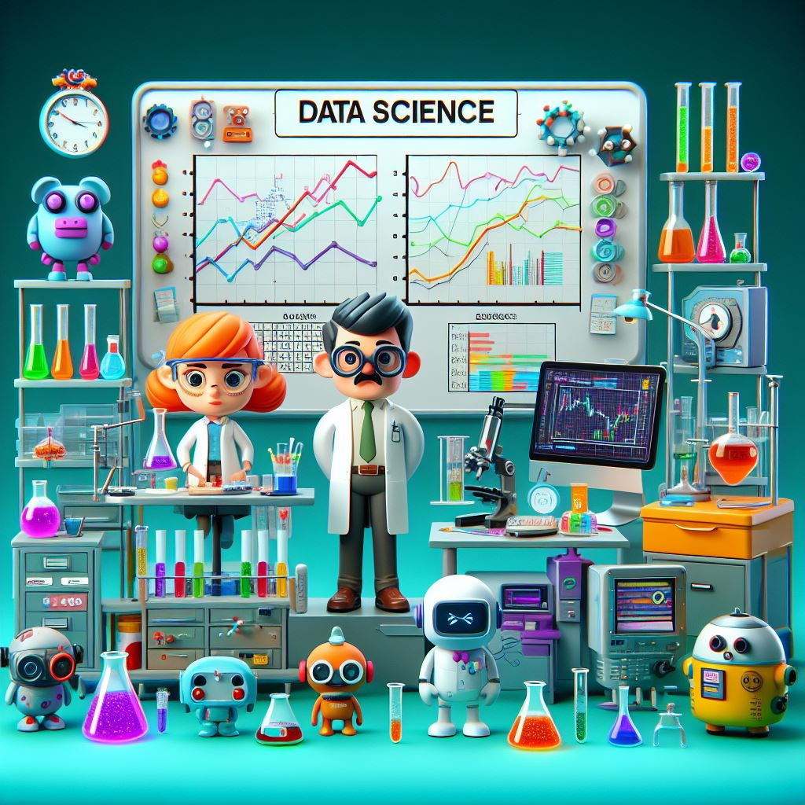

# Laboratório de Ciência de Dados
## Introdução

---

# Objetivos:

- Capacitar os alunos com habilidades **práticas** essenciais para trabalhar com dados de forma **eficiente**.
- Preparar os alunos para enfrentar **desafios reais** em análise de dados e tomar decisões fundamentadas com base em evidências.
- Explorar as **bibliotecas e ferramentas** mais populares para análise de dados em Python.

---

# Bibliografia

  - MENEZES, Nilo Ney Coutinho. Introdução à programação com Python: algoritmos e lógica de programação para iniciantes.
  
  - VANDERPLAS, Jake. Python Data Science Handbook. Disponível em: https://jakevdp.github.io/PythonDataScienceHandbook/.
   
  - HETLAND, Magnus Lie; SPRINGERLINK (ONLINE SERVICE). Python Algorithms: Mastering Basic Algorithms in the Python Language. 
  
  - BERTHOLD, M. et al. Guide to Intelligent Data Analysis : How to Intelligently Make Sense of Real Data  Disponível em: http://dx.doi.org/10.1007/978-1-84882-260-3. 

---

# O que é Ciência de Dados?

- O termo "cientista de dados" foi cunhado por **D.J. Patil**. Ele foi o Cientista Chefe do *LinkedIn*. Em 2011

- Um cientista de dados **faz perguntas** únicas e interessantes sobre os dados para gerar *insights* rigorosos e úteis.

- O papel dos cientistas de dados é gerar **inteligência** de negócios **aplicável**, transformando organizações e sociedades.

---
<!-- backgroundImage: "" -->
<!-- _backgroundColor: #222 -->
<!-- _color: white -->

 # "Um cientista de dados é alguém que é melhor em **estatística** do que qualquer programador e melhor em **programação** do que qualquer estatístico."

---

# Áreas do conhecimento

- **Matemática** e **Estatística**
- **Computação** (programação, banco de dados, etc.)
- **Comunicação** (escrita, visualização de dados, etc.)
- **Áreas específicas** de aplicação (saúde, finanças, marketing, etc.)

---

# Importância da Ciência de Dados

- Geração de *insights* valiosos a partir de dados
- Auxílio na **tomada de decisões** estratégicas
- Impacto em diversas áreas da sociedade

---

# Exemplos de Aplicações

- **Saúde**: Análise de dados clínicos para diagnóstico e tratamento
- **Finanças**: Previsão de mercado e análise de risco
- **Marketing**: Segmentação de mercado e personalização de campanhas
- **Transporte**: Otimização de rotas e logística

---

# O que são *insights*?

- **Compreensão repentina de um problema**, ocasionada por uma percepção mental clara e, geralmente intuitiva, dos elementos que levam a sua resolução.
- **Iluminação**; revelação ou visão inesperada e repentina de alguma coisa.
- [Psiquiatria] Autoconhecimento; habilidade de julgar com objetividade a sua própria maneira de agir.
- [Religião] Expressão de um conhecimento místico; visão mística.

[Fonte](https://www.dicio.com.br/insight/)

---

Alternativas em português para *insight*:
- **Percepção**
- **Intuição**
- **Entendimento**
- **Revelação**
- **Visão**
- **Iluminação**
- **Estalo**
- **Sacada**

---

# Conclusão

- A **Ciência de Dados** é uma disciplina **interdisciplinar** que desempenha um papel fundamental em diversas áreas da sociedade, permitindo a extração de **percepções** valiosas a partir de **dados** e impactando **decisões** estratégicas.

---

# Exercícios

- O que é um cientista de dados?
- Quais são as áreas do conhecimento que compõem a ciência de dados?
- Quais são as aplicações da ciência de dados em diferentes áreas?
- Qual é a importância da ciência de dados para a sociedade?
- Quais são os exemplos de aplicações da ciência de dados em diferentes áreas?
