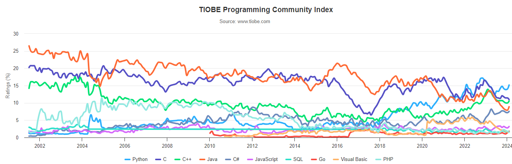

# Ambientes Interativos de Análise de Dados

## Um ambiente interativo de análise de dados é uma ferramenta que permite aos usuários explorar, manipular e visualizar dados de forma interativa. 


---
## Exemplos de Ambientes

1. **Jupyter Notebooks**
   - Aplicação web de código aberto para criar documentos que contenham código executável, equações, visualizações e texto explicativo.

2. **RStudio**
   - Ambiente de desenvolvimento integrado (IDE) para a linguagem de programação R, com recursos avançados para análise de dados e geração de relatórios.

---

3. **IBM Watson Studio**
   - Plataforma de ciência de dados e aprendizado de máquina na nuvem, oferecendo ferramentas para explorar, preparar e analisar dados, além de desenvolver modelos de machine learning.
  
4. **Microsoft Azure Notebooks**
   - Serviço baseado em nuvem que permite criar e executar notebooks Jupyter diretamente no navegador, com recursos poderosos de análise de dados e machine learning.

---

5. **Google Colab**
   - Serviço gratuito baseado na nuvem que oferece notebooks Jupyter hospedados no Google Drive, com acesso a recursos de hardware acelerados, como GPUs, para treinamento de modelos de aprendizado profundo.


---

## Google Colab: Uma Visão Geral

- Ambiente de desenvolvimento baseado em nuvem para Python
- Integração com o Google Drive
- Suporte para execução de código em Python
- GPUs e TPUs disponíveis para aceleração de computação


---

### Vantagens do Google Colab

- Acesso gratuito e fácil
- Armazenamento e compartilhamento de notebooks via Google Drive
- Grande variedade de bibliotecas Python disponíveis
- Utilização de hardware acelerado para análises mais rápidas
- Não depende de instalação local de software

---

## Tutorial Google Colab

### Passo 1: Acessando o Google Colab

- Acesse [colab.research.google.com](https://colab.research.google.com/)
- Faça login com sua conta do Google, se necessário

### Passo 2: Criando um Novo Notebook

- Clique em "Novo Notebook" ou acesse "Arquivo" > "Novo Notebook"

### Passo 3: Executando Código

- Células de texto: adicione texto formatado usando **Markdown**
- Células de código: escreva e execute código **Python**

---

## Markdown


- Markdown é uma linguagem de marcação leve com sintaxe fácil de usar.
- Foi criado para ser simples de ler e escrever, enquanto ainda permite a formatação de texto de forma estruturada.

---

### Por que usar Markdown?

- **Simplicidade:** Markdown é fácil de aprender e usar.
- **Portabilidade:** Arquivos Markdown podem ser lidos em qualquer editor de texto e podem ser convertidos para HTML, PDF e outros formatos.
- **Versatilidade:** Markdown suporta formatação básica de texto, listas, tabelas, imagens e links.
- **Fórmulas Matemáticas:** Markdown suporta fórmulas matemáticas usando LaTeX.

---

### Sintaxe Básica

```markdown
# Título 1

## Título 2

### Título 3
```
# Título 1
## Título 2
### Título 3

--- 
### Texto

```markdown
**Texto em Negrito**

*Texto em Itálico*

***Texto em Negrito e Itálico***

~~Texto Tachado~~

```
**Texto em Negrito**

*Texto em Itálico*

***Texto em Negrito e Itálico***

~~Texto Tachado~~

---

### Códigos

```markdown
`Código em linha`
```
`Código em linha`

```markdown
'''python
for i in range(5):
    print("Olá, Mundo!")
'''
```
```python
for i in range(5):
    print("Olá, Mundo!")
```

---

### Listas

#### Não Ordenadas

```markdown
- Item 1
- Item 2
  - Subitem 2.1
  - Subitem 2.2
- Item 3
```
- Item 1
- Item 2
  - Subitem 2.1
  - Subitem 2.2
- Item 3
  
---

#### Listas Ordenadas
```markdown
1. Item 1
1. Item 2
1. Item 3
```
1. Item 1
1. Item 2
1. Item 3
---

### Links e Imagens

```markdown
[Texto do Link](https://www.google.com)


```
[Texto do Link](https://www.google.com)


---

### Tabelas

```markdown
| Coluna 1 | Coluna 2 | Coluna 3 |
|----------|----------|----------|
| Dado 1   | Dado 2   | Dado 3   |
| Dado 4   | Dado 5   | Dado 6   |
```
| Coluna 1 | Coluna 2 | Coluna 3 |
|----------|----------|----------|
| Dado 1   | Dado 2   | Dado 3   |
| Dado 4   | Dado 5   | Dado 6   |

---

### Fórmulas

- Markdown suporta fórmulas matemáticas usando LaTeX.

```markdown	
Fórmula em linha $\sum_{i=0}^5 i^2$
Fórmula em bloco:
$$
\int_0^\infty x^2 dx
$$
```

Fórmula em linha $\sum_{i=0}^5 i^2$
Fórmula em bloco:
$$
\int_0^\infty x^2 dx
$$

---


# Revisão de Python

## Histórico

- Guido Van Rossum, criou o Python. Ele começou em 1989 no Centrum Wiskunde & Informatica (CWI), inicialmente como um projeto de hobby para se manter ocupado durante o Natal. 
- O nome da linguagem foi inspirado no programa de TV da BBC “Monty Python’s Flying Circus”, porque Guido Van Rossum era um grande fã do programa. 


---

## Principais Marcos

- Guido Van Rossum publicou a primeira versão do código Python (versão 0.9.0) em 1991. Ela já incluía bons recursos, como alguns tipos de dados e funções para tratamento de erros. 
- O Python 1.0 foi lançado em 1994 com novas funções para processar facilmente uma lista de dados, como mapear, filtrar e reduzir.
- O Python 2.0 foi lançado em 16 de outubro de 2000, com novos recursos úteis para programadores, como suporte para caracteres Unicode e um modo mais rápido de percorrer uma lista.
- Em 3 de dezembro de 2008, foi lançado o Python 3.0. Ele incluía recursos como a função de impressão e mais suporte para divisão de números e tratamento de erros. 

[fonte](https://aws.amazon.com/pt/what-is/python/#:~:text=altera%C3%A7%C3%B5es%20no%20c%C3%B3digo.-,Qual%20%C3%A9%20a%20hist%C3%B3ria%20do%20Python%3F,manter%20ocupado%20durante%20o%20Natal.)

---

## Popularidade e Uso

- Python é uma das linguagens de programação mais populares do mundo, conhecida por sua sintaxe simples e legibilidade.



[fonte](https://www.tiobe.com/tiobe-index/)

---

## Características

- **Uma linguagem interpretada:** Executa diretamente o código linha por linha. 
- **Uma linguagem fácil de usar:** O Python usa palavras semelhantes às do inglês. Esconde a complexidade de tarefas de baixo nível, como gerenciamento de memória e arquitetura de computadores.
- **Uma linguagem com tipos dinâmicos:** Os programadores não precisam declarar tipos de variáveis ao escrever o código, porque o Python os determina no tempo de execução. 
- **Uma linguagem orientada a objetos:** O Python considera tudo como um objeto, mas também aceita outros tipos de programação, como estruturada e funcional.
- **Uma vasta disponibilidade de bibliotecas:** O Python tem uma grande comunidade de desenvolvedores que contribuem com bibliotecas e frameworks para ajudar a resolver problemas comuns.+
  
---

## Bibliotecas Python

- **NumPy:** Biblioteca para computação numérica, com suporte para arrays e matrizes multidimensionais.
- **Pandas:** Biblioteca para manipulação e análise de dados, com suporte para estruturas de dados como DataFrames e Series.
- **Scikit-learn:** Biblioteca para aprendizado de máquina, com suporte para algoritmos de classificação, regressão e agrupamento.
- **Matplotlib, Seaborn, Plotly:** Biblioteca para criação de visualizações estáticas, como gráficos de linha, barras e dispersão.
- **TensorFlow, Keras:** Biblioteca para aprendizado de máquina e aprendizado profundo, com suporte para construção e treinamento de modelos de redes neurais.
- **muito mais...**

---

## Frameworks Python

> Um framework é uma estrutura de suporte para o desenvolvimento de software. Ele fornece uma base para a criação de aplicativos e oferece uma série de ferramentas e bibliotecas para facilitar o desenvolvimento.

- **Django, Flask, Streamlit:** Framework para desenvolvimento de aplicativos da web, com suporte para criação de sites e APIs.
- **PyTorch:** Framework para aprendizado de máquina e aprendizado profundo, com suporte para construção e treinamento de modelos de redes neurais.
- **Dash:** Framework para criação de aplicativos da web interativos, com suporte para visualizações de dados e painéis de controle.

- **muito mais...**

---

## IDEs Python

> Uma IDE (Integrated Development Environment) é um ambiente que fornece ferramentas para escrever, testar e depurar código.

- Visual Studio Code
- PyCharm
- Spyder
- Google Colab
- Jupyter Notebook
- IDLE
- Atom
    
---

## Principais Elementos da Linguagem

- **Saída de Dados:** A função `print()` é usada para exibir dados na tela.
- **Entrada de Dados:** A função `input()` é usada para receber dados do usuário.
- **Variáveis:** São usadas para armazenar dados em memória.
- **Operadores:** São usados para realizar operações em variáveis e valores.
- **Estruturas de Controle:** São usadas para controlar o fluxo de execução do programa.
- **Funções:** São usadas para agrupar um conjunto de instruções em um bloco reutilizável.
---

## Outros Elementos da Linguagem

- **Coleções de Dados:** São usadas para armazenar múltiplos valores em uma única variável.
- **Manipulação de Arquivos:** É usado para ler e escrever dados em arquivos.
- **Orientação a Objetos:** É usado para criar e manipular objetos em Python.
- **Tratamento de Exceções:** É usado para lidar com erros e exceções em Python.
- **Módulos e Pacotes:** São usados para organizar e reutilizar código em Python.
- **Bibliotecas e Frameworks:** São usados para estender as funcionalidades do Python.
 
---

### Saída de Dados

> Saída de dados é a forma como um programa exibe informações para o usuário.

Programa em Python:
```python	
print("Olá, Mundo!")
```
Resultado:
```python
Olá, Mundo!
```

---

### Variáveis

> Variáveis são usadas para armazenar dados em memória.

Programa em Python:
```python
nome = "Albert"
idade = 30
altura = 1.75
print(nome, idade, altura)
```
Resultado:
```python
Albert 30 1.75
```
---

#### Tipos de Dados

- **Inteiros:** `int`
- **Números de Ponto Flutuante:** `float`
- **Números Complexos:** `complex`
- **Booleanos:** `bool`
- **Cadeias de Caracteres:** `str`
- **Listas:** `list`
- **Tuplas:** `tuple`
- **Conjuntos:** `set`
- **Dicionários:** `dict`

---
#### Literais

- **Inteiros:** `10`, `100`, `1000`
- **Números de Ponto Flutuante:** `3.14`, `2.718`
  - **Notação Científica:** `1e3`, `2.5e-4`
- **Números Complexos:** `3 + 4j`, `5 - 6j`
- **Booleanos:** `True`, `False`
- **Cadeias de Caracteres:** `'Olá, Mundo!'`, `"Python"`
- **Listas:** `[1, 2, 3]`, `['a', 'b', 'c']`
- **Tuplas:** `(1, 2, 3)`, `('a', 'b', 'c')`
- **Conjuntos:** `{1, 2, 3}`, `{'a', 'b', 'c'}`
- **Dicionários:** `{'a': 1, 'b': 2, 'c': 3}`

---

#### Características das Variáveis

- **Nomes de variáveis:** Podem conter letras, números e sublinhados, mas não podem começar com um número.
- **Tipos de variáveis:** O Python é uma linguagem de tipagem dinâmica, o que significa que o tipo de uma variável é determinado no tempo de execução.
- **Atribuição de variáveis:** É feita usando o operador de atribuição `=`.
- **Convenções de nomenclatura:** As variáveis seguem convenções de nomenclatura, como `snake_case` para nomes de variáveis e `CamelCase` para nomes de classes.
- **Palavras-chave reservadas:** Existem palavras-chave reservadas que não podem ser usadas como nomes de variáveis, como `if`, `else`, `for`, `while`, `def`, `class`, etc.
- **Escopo de variáveis:** As variáveis têm escopo local ou global, dependendo de onde são definidas.

---

### Entrada de Dados

> Entrada de dados é a forma como um programa recebe informações do usuário.

Programa em Python:
```python
nome = input("Digite seu nome: ")
print("Olá,", nome)
```
Resultado:
```python
Digite seu nome: Albert
Olá, Albert
```

---

### Entrada de Valores Numéricos

> A função `input()` retorna uma string, que pode ser convertida em um número usando as funções `int()` e `float()`.

Programa em Python:
```python
idade = int(input("Digite sua idade: "))
altura = float(input("Digite sua altura: "))
print(idade, altura)
```
Resultado:
```python
Digite sua idade: 30
Digite sua altura: 1.75
30 1.75
```

---

### Operadores Aritméticos

- **Adição:** `+`
- **Subtração:** `-`
- **Multiplicação:** `*`
- **Divisão:** `/`
- **Divisão Inteira:** `//`
- **Resto da Divisão:** `%`
- **Exponenciação:** `**`

---

...
...
- **Atribuição com Operação:** `+=`, `-=`, `*=`, `/=`, `//=`, `%=`, `**=`
- **Operadores de Comparação:** `==`, `!=`, `>`, `<`, `>=`, `<=`
- **Operadores Lógicos:** `and`, `or`, `not`
- **Operadores de Associação:** `in`, `not in`
- **Operadores de Identidade:** `is`, `is not`
- **Operadores Ternários:** `if`, `else`
- **Operadores Bit a Bit:** `&`, `|`, `^`, `~`, `<<`, `>>`
- **Precedência de Operadores:** `()`, `**`, `*`, `/`, `//`, `%`, `+`, `-`

---
> Python não possui operadores de incremento e decremento (`++` e `--`).
---

#### Exemplo 1

```python
# Cálculo de IMC	
peso = float(input("Digite seu peso (kg): "))
altura = float(input("Digite sua altura (m): "))
imc = peso / altura ** 2
print("Seu IMC é:", imc)
```

---

#### Exemplo 2

```python
# Atribuição com Operação
x = 5
x += 3
print(x)
```

---

#### Exemplo 3

```python
# Divisão Inteira vs Divisão Real
a = 10
b = 3
print(a // b)  # Divisão Inteira
print(a / b)   # Divisão Real
```

---

#### Exemplo 4

```python
# Operador ternário
idade = 18
maioridade = "Maior de Idade" if idade >= 18 else "Menor de Idade"
print(maioridade)
```

---

### Estruturas de Controle

> Estruturas de controle são usadas para controlar o fluxo de execução do programa.

- **Estruturas Condicionais:** `if`, `elif`, `else`
- **Estruturas de Repetição:** `for`, `while`
- **Estruturas de Controle de Loop:** `break`, `continue`
- **Estruturas de Controle de Função:** `return` , `yield`, `pass`
- **Estruturas de Controle de Exceção:** `try`, `except`, `finally`
- **Estruturas de Controle de Contexto:** `with`

---

#### IF...ELSE

```python	
x = 15
if x > 5:
   x = 5
print(x)
```

```python
idade = 18
if idade >= 18:
    print("Maior de Idade")
else:
    print("Menor de Idade")
```

---

#### ELIF

```python
idade = 18
if idade < 18:
    print("Criança")
elif idade < 60:
    print("Adulto")
else:
    print("Idoso")
```

---


#### WHILE

```python
i = 1
while i <= 5:
    print(i)
    i += 1
```

---

#### FOR

```python
for i in range(5):
    print(i)
```
---

#### Função Range

- Range é uma função que gera uma sequência de números.- Ela pode receber um, dois ou três argumentos.
- Se receber um argumento, gera uma sequência de 0 até o número anterior ao argumento.
- Se receber dois argumentos, gera uma sequência do primeiro argumento até o número anterior ao segundo argumento.
- Se receber três argumentos, gera uma sequência do primeiro argumento até o número anterior ao segundo argumento, com um intervalo definido pelo terceiro argumento.

---

##### Exemplos

```python
for i in range(5):
    print(i)
```

```python
for i in range(2, 5):
    print(i)
```

```python
for i in range(1, 10, 2):
    print(i)
```
---

##### Exemplo com incremento negativo

```python
for i in range(5, 0, -1):
    print(i)
```

---

> ´for´ é usado para iterar sobre uma sequência (como uma lista, tupla, dicionário, conjunto ou string) ou outros objetos iteráveis. Veremos mais sobre isso em aulas futuras.

---

#### BREAK e CONTINUE

- **Break:** Interrompe a execução do loop.
```python
for i in range(5):
    if i == 3:
        break
    print(i)
```
- **Continue:** Interrompe a execução atual do loop e continua com a próxima iteração.
```python
for i in range(5):
    if i == 3:
        continue
    print(i)
```
---

#### For...Else

- O bloco `else` é executado quando o loop termina sem interrupção.
```python
x = 113
for i in range(2, x):
    if x % i == 0:
        print("Não é primo")
        break
else:
    print("É primo")
```

- Também pode ser usado com `while`.
---

> Python não possui do...while.

```python	
# Exemplo de do...while
while True:
    x = int(input("Digite um número: "))
    x += 1
    if x == 5:
        break
```
---


---
## Passo 4: Importando Dados

- Monte o Google Drive para acessar seus arquivos
- Use bibliotecas Python como Pandas para importar conjuntos de dados

---

## Passo 5: Visualizando e Analisando Dados

- Utilize bibliotecas como Matplotlib e Seaborn para criar visualizações
- Realize análises exploratórias de dados para extrair insights

---

## Passo 6: Salvando e Compartilhando seu Notebook

- Salve seu trabalho no Google Drive
- Compartilhe o link do seu notebook com outras pessoas

---

# Conclusão

- O Google Colab é uma ferramenta poderosa para análise de dados baseada em nuvem, oferecendo acesso gratuito e fácil, suporte para execução de código Python e integração com o Google Drive. Com este tutorial básico, você está pronto para começar a explorar e trabalhar com dados no Google Colab!
