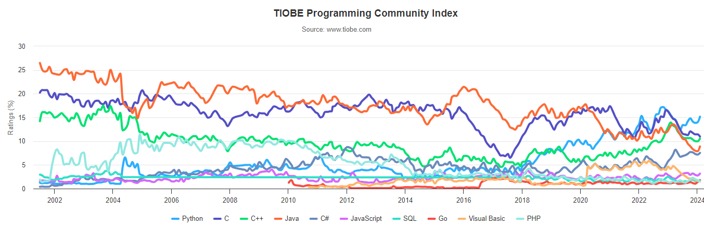

# Não Tão Curta Revisão de Python

Python é uma linguagem de programação de **alto nível, interpretada, orientada a objetos e de tipagem dinâmica**. 

É conhecida por sua **sintaxe simples** e legibilidade.

---

## Histórico

- **Guido Van Rossum**, criou o Python. Ele começou em 1989 no Centrum Wiskunde & Informatica (CWI), inicialmente como um projeto de hobby para se manter ocupado durante o **Natal**. 
- O nome da linguagem foi inspirado no programa de TV da BBC “**Monty Python’s Flying Circus**”, porque Guido Van Rossum era um grande fã do programa. 

---

### Principais Marcos

- Primeira versão do código Python (versão 0.9.0) foi publicada em **1991**. 
- O Python 1.0 foi lançado em **1994** com novas funções para processar facilmente uma lista de dados, como mapear, filtrar e reduzir.
- O Python 2.0 foi lançado em **16 de outubro de 2000**, com novos recursos úteis para programadores, como suporte para caracteres Unicode e um modo mais rápido de percorrer uma lista.
- Em **3 de dezembro de 2008**, foi lançado o Python 3.0. 

[fonte](https://aws.amazon.com/pt/what-is/python/#:~:text=altera%C3%A7%C3%B5es%20no%20c%C3%B3digo.-,Qual%20%C3%A9%20a%20hist%C3%B3ria%20do%20Python%3F,manter%20ocupado%20durante%20o%20Natal.)

---

## Popularidade e Uso

- Python é uma das linguagens de programação mais populares do mundo, conhecida por sua sintaxe simples e legibilidade.

[fonte](https://www.tiobe.com/tiobe-index/)

---

## Características

- **Uma linguagem interpretada:** Executa diretamente o código linha por linha. 
- **Uma linguagem fácil de usar:** O Python usa palavras semelhantes às do inglês. Esconde a complexidade de tarefas de baixo nível, como gerenciamento de memória e arquitetura de computadores.
- **Uma linguagem com tipos dinâmicos:** Os programadores não precisam declarar tipos de variáveis ao escrever o código, porque o Python os determina no tempo de execução. 
- **Uma linguagem orientada a objetos:** O Python considera tudo como um objeto, mas também aceita outros tipos de programação, como estruturada e funcional.
- **Uma vasta disponibilidade de bibliotecas:** O Python tem uma grande comunidade de desenvolvedores que contribuem com bibliotecas e frameworks para ajudar a resolver problemas comuns.+
  
---

## Bibliotecas Python

- **NumPy:** Biblioteca para computação numérica, com suporte para arrays e matrizes multidimensionais.
- **Pandas:** Biblioteca para manipulação e análise de dados, com suporte para estruturas de dados como DataFrames e Series.
- **Scikit-learn:** Biblioteca para aprendizado de máquina, com suporte para algoritmos de classificação, regressão e agrupamento.
- **Matplotlib, Seaborn, Plotly:** Biblioteca para criação de visualizações estáticas, como gráficos de linha, barras e dispersão.
- **TensorFlow, Keras:** Biblioteca para aprendizado de máquina e aprendizado profundo, com suporte para construção e treinamento de modelos de redes neurais.
- **muito mais...**

---

## Frameworks Python

> Um framework é uma estrutura de suporte para o desenvolvimento de software. Ele fornece uma base para a criação de aplicativos e oferece uma série de ferramentas e bibliotecas para facilitar o desenvolvimento.

- **Django, Flask, Streamlit:** Framework para desenvolvimento de aplicativos da web, com suporte para criação de sites e APIs.
- **PyTorch:** Framework para aprendizado de máquina e aprendizado profundo, com suporte para construção e treinamento de modelos de redes neurais.
- **Dash:** Framework para criação de aplicativos da web interativos, com suporte para visualizações de dados e painéis de controle.

- **muito mais...**

---

## IDEs Python

**Integrated Development Environment** é um ambiente que fornece ferramentas para escrever, testar e depurar código.

- Visual Studio Code
- PyCharm
- Spyder
- **Google Colab**
- Jupyter Notebook
- IDLE
- Atom

    
---

## Principais Elementos da Linguagem

- **Saída de Dados:** A função `print()` é usada para exibir dados na tela.
- **Entrada de Dados:** A função `input()` é usada para receber dados do usuário.
- **Variáveis:** São usadas para armazenar dados em memória.
- **Operadores:** São usados para realizar operações em variáveis e valores.
- **Estruturas de Controle:** São usadas para controlar o fluxo de execução do programa.
- **Funções:** São usadas para agrupar um conjunto de instruções em um bloco reutilizável.
---

## Outros Elementos da Linguagem

- **Coleções de Dados:** São usadas para armazenar múltiplos valores em uma única variável.
- **Manipulação de Arquivos:** É usado para ler e escrever dados em arquivos.
- **Orientação a Objetos:** É usado para criar e manipular objetos em Python.
- **Tratamento de Exceções:** É usado para lidar com erros e exceções em Python.
- **Módulos e Pacotes:** São usados para organizar e reutilizar código em Python.
- **Bibliotecas e Frameworks:** São usados para estender as funcionalidades do Python.
 
---

## Exercícios

1. O que significa que o Python é uma linguagem interpretada?
2. Quais as vantagens de usar o Python?
3. Quais as principais bibliotecas de Python?
4. Qual a principal desvantagem de usar o Python?
5. O que é identação e qual a sua importância em Python?