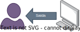
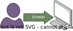

<!-- _color: #172020 -->
<!-- _backgroundImage: url('bg/light_wood2.jpg') -->

# <!--fit--> Entrada, Saída e <br>Atribuição


---
## Saída de Dados

> Saída de dados é a forma como um programa exibe informações para o usuário.

Programa em Python:
```python	
>>> print("Olá, Mundo!")
Olá, Mundo!
```



---

>  No Colab, o último valor de uma célula é exibido automaticamente.

```python
x = 10
x
```
Resultado:
` 10`

---

### Opções úteis da função `print()`

- **Separador:** O argumento `sep` é usado para definir o separador entre os itens.
- **Final:** O argumento `end` é usado para definir o final da saída.

```python
print("Olá", "Mundo", sep=", ", end="!\n")
```
Resultado:
```python
Olá, Mundo!
```
---

## Variáveis

> Variáveis são usadas para armazenar dados em memória.

Programa em Python:
```python
nome = "Albert"
idade = 30
altura = 1.75
print(nome, idade, altura)
```
Resultado:
```python
Albert 30 1.75
```
---

### Tipos de Dados

- **Inteiros:** `int`
- **Números de Ponto Flutuante:** `float`
- **Números Complexos:** `complex`
- **Booleanos:** `bool`
- **Cadeias de Caracteres:** `str`
- **Listas:** `list`
- **Tuplas:** `tuple`
- **Conjuntos:** `set`
- **Dicionários:** `dict`

---
### Literais

- **Inteiros:** `10`, `100`, `1000`
- **Números de Ponto Flutuante:** `3.14`, `2.718`
  - **Notação Científica:** `1e3`, `2.5e-4`
- **Números Complexos:** `3 + 4j`, `5 - 6j`
- **Booleanos:** `True`, `False`
- **Cadeias de Caracteres:** `'Olá, Mundo!'`, `"Python"`
- **Listas:** `[1, 2, 3]`, `['a', 'b', 'c']`
- **Tuplas:** `(1, 2, 3)`, `('a', 'b', 'c')`
- **Conjuntos:** `{1, 2, 3}`, `{'a', 'b', 'c'}`
- **Dicionários:** `{'a': 1, 'b': 2, 'c': 3}`

---

### Características das Variáveis

- **Nomes de variáveis:** Podem conter letras, números e sublinhados, mas não podem começar com um número.
- **Tipos de variáveis:** O Python é uma linguagem de tipagem dinâmica, o que significa que o tipo de uma variável é determinado no tempo de execução.
- **Atribuição de variáveis:** É feita usando o operador de atribuição `=`.
- **Convenções de nomenclatura:** As variáveis seguem convenções de nomenclatura, como `snake_case` para nomes de variáveis e `CamelCase` para nomes de classes.
- **Palavras-chave reservadas:** Existem palavras-chave reservadas que não podem ser usadas como nomes de variáveis, como `if`, `else`, `for`, `while`, `def`, `class`, etc.
- **Escopo de variáveis:** As variáveis têm escopo local ou global, dependendo de onde são definidas.

---

### Entrada de Dados

> Entrada de dados é a forma como um programa recebe informações do usuário.

Programa em Python:
```python
nome = input("Digite seu nome: ")
print("Olá,", nome)
```
Resultado:
```python
Digite seu nome: Albert
Olá, Albert 
```



---

### Entrada de Valores Numéricos

> A função `input()` retorna uma string, que pode ser convertida em um número usando as funções `int()` e `float()`.

Programa em Python:
```python
idade = int(input("Digite sua idade: "))
altura = float(input("Digite sua altura: "))
print(idade, altura)
```
Resultado:
```python
Digite sua idade: 30
Digite sua altura: 1.75
30 1.75
```

---

### Operadores Aritméticos

- **Adição:** `+`
- **Subtração:** `-`
- **Multiplicação:** `*`
- **Divisão:** `/`
- **Divisão Inteira:** `//`
- **Resto da Divisão:** `%`
- **Exponenciação:** `**`

---


- **Atribuição com Operação:** `+=`, `-=`, `*=`, `/=`, `//=`, `%=`, `**=`
- **Operadores de Comparação:** `==`, `!=`, `>`, `<`, `>=`, `<=`
- **Operadores Lógicos:** `and`, `or`, `not`
- **Operadores de Associação:** `in`, `not in`
- **Operadores de Identidade:** `is`, `is not`
- **Operadores Ternários:** `if`, `else`
- **Operadores Bit a Bit:** `&`, `|`, `^`, `~`, `<<`, `>>`
- **Precedência de Operadores:** `()`, `**`, `*`, `/`, `//`, `%`, `+`, `-`

---

> Python não possui operadores de incremento e decremento (`++` e `--`).

---

> Observação: Ao programar com `float`, tome cuidado ao usar igualdade (`==`) para comparação, pois a representação de números de ponto flutuante pode levar a resultados inesperados.

```python
0.1 + 0.2 == 0.3
# Resultado: False
```
- Uma solução é usar a função `math.isclose()`.

```python   
import math
math.isclose(0.1 + 0.2, 0.3)
#Resultado: True
```

---

>Observação: Python permite a combinação de operadores relacionais encadeados.

```python
x = 5
print(0 < x < 10)
# Resultado: True
```

- esta expressão é equivalente a `0 < x and x < 10`.
- outras linguagens de programação, como Java, não permitem essa combinação.
- a linguagem **C** permite, mas o resultado é completamente diferente.


---

### Parentização de Operadores

- **Precedência de Operadores:** `()`, `**`, `*`, `/`, `//`, `%`, `+`, `-`

> ao contrário da algebra, onde são usadas chaves e colchetes, em Python e muitas outras linguagens, são usados apenas parênteses para definir a precedência de operadores.

```python
# baskara
a,b,c = 1,2,1
x1 = (-b + (b**2 - 4*a*c)**0.5) / (2*a)
x2 = (-b - (b**2 - 4*a*c)**0.5) / (2*a)
``` 


---

#### Exemplo 1

```python
# Cálculo de IMC	
peso = float(input("Digite seu peso (kg): "))
altura = float(input("Digite sua altura (m): "))
imc = peso / altura ** 2
print("Seu IMC é:", imc)
```


#### Exemplo 2

```python
# Atribuição com Operação
x = 5
x += 3
print(x)
```

---

#### Exemplo 3

```python
# Divisão Inteira vs Divisão Real
a = 10
b = 3
print(a // b)  # Divisão Inteira
print(a / b)   # Divisão Real
```


#### Exemplo 4

```python
# Operador ternário
idade = 18
maioridade = "Maior de Idade" if idade >= 18 else "Menor de Idade"
print(maioridade)
```
---


### Blocos de Código

- Ao contrário de outras linguagens de programação *C-like*, Python não usa chaves para definir blocos de código.
- **Indentação:** Python usa a indentação para definir blocos de código.
- **Blocos de Código:** São usados para agrupar instruções em um bloco.

```python
if x > 5:
    x = 5
    print(x)    
print("bola")
```

- Portanto, a indentação é muito importante em Python, pois altera o significado do código.

---

### Quebras de Linha

- Python usa quebras de linha para indicar o fim de uma instrução.
- Se uma instrução é muito longa, pode ser dividida em várias linhas usando a barra invertida `\`.
- Se uma instrução está entre parênteses, colchetes ou chaves, ela pode ser dividida em várias linhas sem usar a barra invertida.

```python   
x = 1 + 2 + 3 + 4 + 5 + \
    6 + 7 + 8 + 9 + 10
```

```python
cores = [
    "vermelho",
    "verde",
    "azul"
]
```

---

### Comentários

- Comentários são usados para explicar o código e torná-lo mais legível.
- Em Python, os comentários são precedidos pelo caractere `#`.
- Comentários de várias linhas podem ser feitos usando aspas triplas `'''` ou `"""`.

```python
# Isto é um comentário
x = 5  # Isto é outro comentário
```

```python
'''
Isto é um comentário
de várias linhas
'''
x = 5
```

---

## Exercícios

1. Escreva um programa que receba o nome e a idade do usuário e exiba a seguinte mensagem: "Olá, [nome]! Você tem [idade] anos.".
2. Escreva um programa que receba o raio de um círculo e exiba a seguinte mensagem: "A área do círculo é [área].", onde [área] é a área do círculo.
3. Escreva um programa que receba um valor em segundos e exiba a seguinte mensagem: "O valor em horas, minutos e segundos é [horas]h [minutos]m [segundos]s.", onde [horas], [minutos] e [segundos] são os valores correspondentes.
---
4. Escreva um programa que receba um valor em metros e exiba a seguinte mensagem: "[metros]m é equivalente a [centímetros]cm, [milímetros]mm, [quilômetros]km e [polegadas]in.", onde [centímetros], [milímetros], [quilômetros] e [polegadas] são os valores correspondentes.
5. Escreva um programa que receba um valor em graus Celsius e exiba a seguinte mensagem: "[celsius]°C é equivalente a [fahrenheit]°F e [kelvin]K.", onde [fahrenheit] e [kelvin] são os valores correspondentes.
   