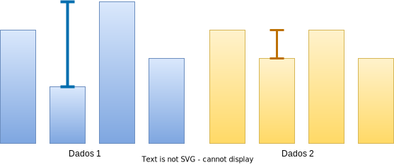

# Estatística

<p class ='small'>Albert E.F. Muritiba</p>


<!--_footer: ' '-->

---

> **Estatística** é a ciência que se dedica à coleta, análise e interpretação de dados. Ela é uma ferramenta essencial para a tomada de decisões em diversas áreas do conhecimento.

---

- **Estatística Descritiva**
  - Descrever e resumir os dados
  - Tabelas, gráficos e medidas resumo
  - **Exemplo**: média, mediana, moda, variância, desvio padrão, etc.
- **Estatística Inferencial**
  - Inferir conclusões sobre uma população a partir de uma amostra
  - Testes de hipóteses, intervalos de confiança, regressão, etc.
  - **Exemplo**: teste t de Student, ANOVA, regressão linear, etc.

> neste curso, vamos focar na **estatística descritiva**.
---

## Estatística Descritiva
---

### Medidas de Posição

- **Média**: Balanço entre todos os valores. Busca o valor central.
  - Aritmética: 
  $$\bar{x} = \frac{\sum_{i=1}^{n} x_i}{n}$$ 
  - Geométrica: 
  $$\bar{g} = \sqrt[n]{\prod_{i=1}^{n} x_i}$$
  - Harmônica: 
   $$\bar{h} = \frac{n}{\sum_{i=1}^{n} \frac{1}{x_i}}$$

---
```python
import numpy as np
x = np.random.randint(1, 100, 50) #50 valores aleatórios entre 1 e 100
```

```python
# Média Aritmética passo a passo
soma = 0
for i in x:
    soma += i
media = soma / len(x)
print(media)
```

```python
# Média Aritmética com numpy
media = np.mean(x)
```

---
  
```python
# Média Geométrica passo a passo
produto = 1
for i in x:
    produto *= i
media = produto ** (1/len(x))
print(media)
```

```python
# Média Geométrica com numpy
media = np.prod(x) ** (1/len(x))
```

```python
from scipy import stats
# Média Geométrica com scipy
media = stats.gmean(x)
``` 
> `scipy` é uma biblioteca de código aberto que fornece muitas ferramentas estatísticas e matemáticas.

---

```python
# Média Harmônica passo a passo
soma = 0
for i in x:
    soma += 1/i
media = len(x) / soma
print(media)
```

```python
# Média Harmônica com numpy
media = len(x) / np.sum(1/x)
```

```python
# Média Harmônica com scipy
media = stats.hmean(x)
```

---

**Observação**: No uso prático, devemos dar preferência ao uso de funções prontas de bibliotecas especializadas, como `scipy`, para cálculos estatísticos. Isso garante maior eficiência e precisão nos cálculos.

---
### Exemplo

Suponha que você tem mil reais investidos e a tabela abaixo mostra o retorno mês a mês. Qual é o retorno médio mensal?
-
---

|Mês|Ret. Absoluto|Ret. Relativo|
|---|--:|--:|
|**C.I.**|1000,00|1,0000|
|Janeiro|100,00|1,1000|
|Fevereiro|200,00|1,1818|
|Março|50,00|1,0385|
|Abril|-200,00|0,8519|
|Maio|-30,00|0,9739|
|Junho|100,00|1,0893|
|**Total**|**1220,00**|7,2353*|
|**Média**|**36,67**|1,0392*|
<!-- _footer: (*) Incorreto! -->
---

- Podemos afirmar que o retorno total foi de R$ 220,00 em 6 meses. O retorno médio foi de R$ 36,67 por mês.

- Mas quando olhamos para o retorno relativo, o total indicado é de 7,2353 , o que é absurdo, pois o valor não ficou 7 vezes maior.
  
- Enquanto a média relativa foi de 1,0392, o que indicaria que o valor ficou 3,92% maior a cada mês. Se isso fosse verdade, o valor final seria de R$ 1259,49.
  
- O que aconteceu? 
  - O total do rendimento relativo deve ser o **produto** dos rendimentos relativos de cada mês.
  - A média relativa deve ser a média **geométrica** dos rendimentos relativos de cada mês.

---
|Mês|Ret. Absoluto|Ret. Relativo|
|---|--:|--:|
|**C.I.**|1000,00|1,0000|
|Janeiro|100,00|1,1000|
|fevereiro|200,00|1,1818|
|março|50,00|1,0385|
|abril|-200,00|0,8519|
|maio|-30,00|0,9739|
|junho|100,00|1,0893|
|**Total**|**1220,00**|**1,220**|
|**Média**|**36,67**|**1,0337**|
---

- Quando o total de uma variável é melhor representado pela **soma** dos valores, a média **aritmética** é a melhor escolha. 
- Quando o total é melhor representado pelo **produto** dos valores, a média **geométrica** é a melhor escolha.

E a **média harmônica?**
--

---
### Exemplo

Suponha que o piloto de corrida fez cinco voltas em um circuito de 10km. A tabela abaixo mostra o tempo e a velocidade média de cada volta. Qual é a velocidade média final do piloto?
-   
---

|Volta|Tempo (h)| Velocidade (km/h)|
|---|--:|--:|
|1	    |0,0455	|220    |
|2	    |0,0450	|222    |
|3	    |0,0500	|200    |
|4	    |0,0435	|230    |
|5	    |0,0495	|202    |
|**Total**	|**0,2335**	|1074*  |
|**Média**	|**0,0467**	|214,8* |

<!-- _footer: (*) Incorreto! -->
---

- Podemos afirmar que o piloto completou o circuito em 0,2335 horas. Cada volta foi feita em média em 0,0467 horas.
- Quando olhamos para a velocidade:
  - A soma como total não faz sentido, pois a velocidade não é acumulativa.
  - A média não corresponde à velocidade média do piloto. Pois, quando dividimos a distância total pela soma dos tempos, obtemos 214,1 km/h.
- Este é um caso em que a **média harmônica** é mais adequada.

---
Cáculo da velocidade média:
$$
v = \frac{\Delta t}{\Delta v}
$$

$$
v = \frac{5 \times 10}{\frac{10}{220} + \frac{10}{222} + \frac{10}{200} + \frac{10}{230} + \frac{10}{202}} 
$$
-
$$
= \frac{5}{\frac{1}{220} + \frac{1}{222} + \frac{1}{200} + \frac{1}{230} + \frac{1}{202}} 
$$
-
$$
= 214,1 \text{ km/h}
$$

>Observe que o cálculo que realizamos é equivalente a calcular a média harmônica dos valores de velocidade.

---

|Volta|Tempo (h)| Velocidade (km/h)|
|---|--:|--:|
|1	    |0,0455	|220    |
|2	    |0,0450	|222    |
|3	    |0,0500	|200    |
|4	    |0,0435	|230    |
|5	    |0,0495	|202    |
|**Total**	|**0,2335**	|--  |
|**Média**	|**0,0467**	|**214,1** |

---

- **Mediana**: Valor central de um conjunto de dados **ordenados**.
  - Se $n$ é ímpar, a mediana é o valor central.
  - Se $n$ é par, a mediana é a média dos dois valores centrais.
```python
# Mediana com numpy
mediana = np.median(x)
```

- Em comparação com a média, a mediana é menos sensível a valores extremos.
- Mediana é mais representativa em distribuições assimétricas.
- Mediana é demanda mais tempo computacional para calcular.


---

- **Moda**: Valor mais frequente em um conjunto de dados.
```python
# Moda com numpy
values, freq = np.unique(x, return_counts=True)
moda = values[np.argmax(freq)]
``` 
  
```python
from scipy import stats
# Moda com scipy
moda = stats.mode(x)
```

> `scipy` é uma biblioteca de código aberto que fornece muitas ferramentas estatísticas e matemáticas.
---

Aplicações:
 - Conjuntos de dados com valores discretos
 - Conjuntos de dados categóricos
  
---

### Medidas de Dispersão

A média, mediana e moda são medidas de posição que descrevem o centro de um conjunto de dados. As medidas de dispersão descrevem a **variabilidade** dos dados.


---

- **Amplitude**: Diferença entre o maior e o menor valor.
```python
# Amplitude com numpy
amplitude = np.ptp(x)
```

 

---


- **Variância**: Média dos quadrados das diferenças entre os valores e a média.
  - População: $\sigma^2 = \frac{\sum_{i=1}^{n} (x_i - \mu)^2}{n}$
  - Amostra: $s^2 = \frac{\sum_{i=1}^{n} (x_i - \bar{x})^2}{n-1}$
```python
# Variância populacional com numpy
variancia = np.var(x, ddof=0)
# Amostra 10 valores de x sem reposição
sample = np.random.choice(x, 10,replace=False) 
# Variância amostral com numpy
variancia = np.var(sample, ddof=1)
```
> `ddof` é o grau de liberdade. Se `ddof=0`, a variância é calculada para a população. Se `ddof=1`, a variância é calculada para a amostra.
> 

---

A razão para usar $n-1$ em vez de $n$ é que a variância amostral é uma estimativa da variância populacional. A simulação abaixo investiga qual fórmula é mais precisa.

```python
import numpy as np
pop = np.random.randint(1, 10000, 1000)
v_pop = np.var(pop, ddof=0)
# Variâncias de 1000 amostras de 100 valores de pop
v_A = np.array([np.var(np.random.choice(pop, 100, replace=False), ddof=0) for _ in range(1000)])
v_B = np.array([np.var(np.random.choice(pop, 100, replace=False), ddof=1) for _ in range(1000)])
print('População:', v_pop)
print('Amostra (ddof=0):', np.mean(v_A))
print('Amostra (ddof=1):', np.mean(v_B))
# erro quadrático médio
print('EQM (ddof=0):', np.mean((v_A - v_pop)**2))
print('EQM (ddof=1):', np.mean((v_B - v_pop)**2))
```


---

- **Desvio Padrão**: Raiz quadrada da variância.
  - População: $\sigma = \sqrt{\sigma^2}$
  - Amostra: $s = \sqrt{s^2}$
```python
# Desvio padrão populacional com numpy
desvio_padrao = np.std(x, ddof=0)   
# Desvio padrão amostral com numpy
desvio_padrao = np.std(sample, ddof=1)
# Desvio padrão populacional com scipy.stats
desvio_padrao = stats.tstd(x, ddof=0)
# Desvio padrão amostral com scipy.stats
desvio_padrao = stats.tstd(sample, ddof=1)

```

> Em média, quanto os valores se desviam da média. Os valores de desvio padrão são mais fáceis de interpretar do que os valores de variância, pois estão na mesma unidade dos dados.

---

A função `stats.tstd` da biblioteca `scipy` oferece outros argumentos que podem ser úteis em algumas situações. 

- `limits`: `(a: float, b: float)` - Valores menores que `a` ou maiores que `b` são ignorados.
- `inclusive`: `(bool, bool)` - Se `True`, os valores `a` e `b` são incluídos na contagem.
- 'nan_policy': `('propagate', 'raise', 'omit')` - Como lidar com valores `nan`.
  - `propagate`: retorna `nan`.
  - `raise`: gera um erro.
  - `omit`: ignora os valores `nan`.

```python
# Desvio padrão populacional com scipy.stats
desvio_padrao = stats.tstd(x, ddof=0, limits=(0, 100), inclusive=(True, False), nan_policy='omit')
```


---

- **Coeficiente de Variação**: Medida de dispersão relativa.
  - $CV = \frac{s}{\bar{x}} \times 100\%$
```python
#CV usando numpy
cv = np.std(x, ddof=0) / np.mean(x) * 100
#CV usando scipy.stats
cv = stats.variation(x) * 100
```

> Em média, quanto os valores se desviam **percentualmente** da média.
--- 


### Medidas de Forma

Dados podem ainda ser classificados de acordo com a forma da distribuição. As medidas de forma descrevem a forma da distribuição dos dados.

<!-- TODO: Adicionar gráficos -->

---

- **Assimetria**: Medida de desvio da simetria em relação à média.
```python
# Assimetria com scipy.stats
assimetria = stats.skew(x)  
```
> skew > 0: assimetria positiva; 
> skew < 0: assimetria negativa
> skew = 0: simetria

https://blog.proffernandamaciel.com.br/assimetria-e-curtose-dos-dados/

---

- **Curtose**: Medida de achatamento da distribuição.
  - Leptocúrtica: mais alta e fina
  - Mesocúrtica: normal
  - Platicúrtica: mais baixa e larga
```python
# Curtose com scipy.stats
curtose = stats.kurtosis(x)
```
>Curtose > 0: mais picos
>Curtose < 0: menos picos
>Curtose = 0: normal

<!-- TODO: Adicionar gráficos -->

---

### Medidas de Associação

Dados podem ser associados de várias maneiras. As medidas de associação descrevem a relação entre duas variáveis.

Sejam $x$ e $y$ duas variáveis aleatórias...
-

---

- **Covariância**: É a média dos produtos dos desvios de cada valor para suas respectivas médias.
  - População: $\sigma_{xy} = \frac{\sum_{i=1}^{n} (x_i - \mu_x)(y_i - \mu_y)}{n}$
  - Amostra: $s_{xy} = \frac{\sum_{i=1}^{n} (x_i - \bar{x})(y_i - \bar{y})}{n-1}$
```python
# Covariância com numpy
cov = np.cov(x, y, ddof=0)
# Covariância com scipy.stats
cov = stats.cov(x, y, ddof=0)
``` 
> `ddof` é o grau de liberdade. Se `ddof=0`, a covariância é calculada para a população. Se `ddof=1`, a covariância é calculada para a amostra.

---

- **Covariância > 0:** associação positiva, ou seja, quando uma variável aumenta, a outra também aumenta.
- **Covariância < 0:** associação negativa, ou seja, quando uma variável aumenta, a outra diminui.
- **Covariância $\approx$ 0:** pouca ou nenhuma associação.

>Obs.: A covariância é uma medida de associação linear. Ela não é normalizada, o que dificulta a interpretação.

---

- **Correlação**: Medida de associação linear normalizada entre duas variáveis.
  - Coeficiente de correlação de Pearson: $r = \frac{s_{xy}}{s_x \times s_y}$, 
  - onde $s_x$ e $s_y$ são os desvios padrão de $x$ e $y$.
  - $s_{xy}$ é a covariância entre $x$ e $y$.
```python
# Correlação com numpy
r = np.corrcoef(x, y)
# Correlação de Pearson com scipy.stats
r, p = stats.pearsonr(x, y)
```

> `p` é o valor-p, que indica a probabilidade de obter uma correlação igual ou mais extrema, assumindo que a hipótese nula é verdadeira.
---

- Os valores da correlação variam de -1 a 1,
- o sinal indica a direção da associação,
- o módulo indica a força da associação.

|Módulo de r|Interpretação|
|---|---|
| $[0,9 - 1]$ |Correlação muito forte|
| $[0,7 - 0,9[$ |Correlação forte|
| $[0,5 - 0,7[$ |Correlação moderada|
| $[0,3 - 0,5[$ |Correlação fraca|
| $[0 - 0,3[$ |Correlação desprezível|
---


## Percentis e Quartis

- **Percentil**: Valor da variável maior que uma certa porcentagem dos dados.
```python
import numpy as np
x = np.array([15, 22, 35, 4, 85])
v = np.percentile(x, 32) 
print(v)
```
> `v` é o valor que é maior que 32% dos dados.

- **Quartil**: Valores de variáveis que dividem os dados em quatro partes iguais.
```python
import numpy as np
x = np.array([15, 22, 35, 4, 85])
q1, q2, q3 = np.percentile(x, [25, 50, 75])
```
> `q1`, `q2` e `q3` são os valores que dividem os dados em quatro partes iguais.

---

## Normalização de Dados

- **Padronização**: Transformação dos dados para ter média zero e desvio padrão um.
  - $z = \frac{x - \bar{x}}{s}$
```python
import numpy as np
x = np.array([15, 22, 35, 4, 85])
z = (x - np.mean(x)) / np.std(x)
```
- Padronização é útil para comparar variáveis com diferentes escalas.
- Padronização é útil para algoritmos de aprendizado de máquina sensíveis à escala.
- Padronização não remove outliers.

---

## Outliers

- **Outliers**: Valores extremos que se desviam significativamente do restante dos dados.
  - Critério de Tukey: $Q_1 - 1.5 \times IQR$ e $Q_3 + 1.5 \times IQR$
```python
import numpy as np
x = np.array([15, 22, 35, 4, 85])
q1, q3 = np.percentile(x, [25, 75])
iqr = q3 - q1
outliers = x[(x < q1 - 1.5*iqr) | (x > q3 + 1.5*iqr)]
```

---

- **Tratamento de Outliers**: 
  - Remoção: remover os outliers do conjunto de dados.
```python
import numpy as np
x = np.array([15, 22, 35, 4, 85])
q1, q3 = np.percentile(x, [25, 75])
iqr = q3 - q1
xa = x[(x >= q1 - 1.5*iqr) & (x <= q3 + 1.5*iqr)]
```
  - Substituição: substituir os outliers por valores mais próximos.
```python
xb = x.copy()
xb[(xb < q1 - 1.5*iqr)] = q1 - 1.5*iqr
xb[(xb > q3 + 1.5*iqr)] = q3 + 1.5*iqr
``` 
  - Ignorar: ignorar os outliers e continuar a análise.
  - Análise separada: analisar os outliers separadamente.

---

## Conclusão

- A estatística descritiva é uma ferramentia essencial para a análise de dados.
- As medidas de posição descrevem o centro dos dados.
- As medidas de dispersão descrevem a variabilidade dos dados.
- As medidas de forma descrevem a forma da distribuição dos dados.
- As medidas de associação descrevem a relação entre duas variáveis.
- Percentis e quartis dividem os dados em partes iguais.
- Normalização de dados é útil para comparar variáveis com diferentes escalas.
- Outliers são valores extremos que se desviam significativamente do restante dos dados.

