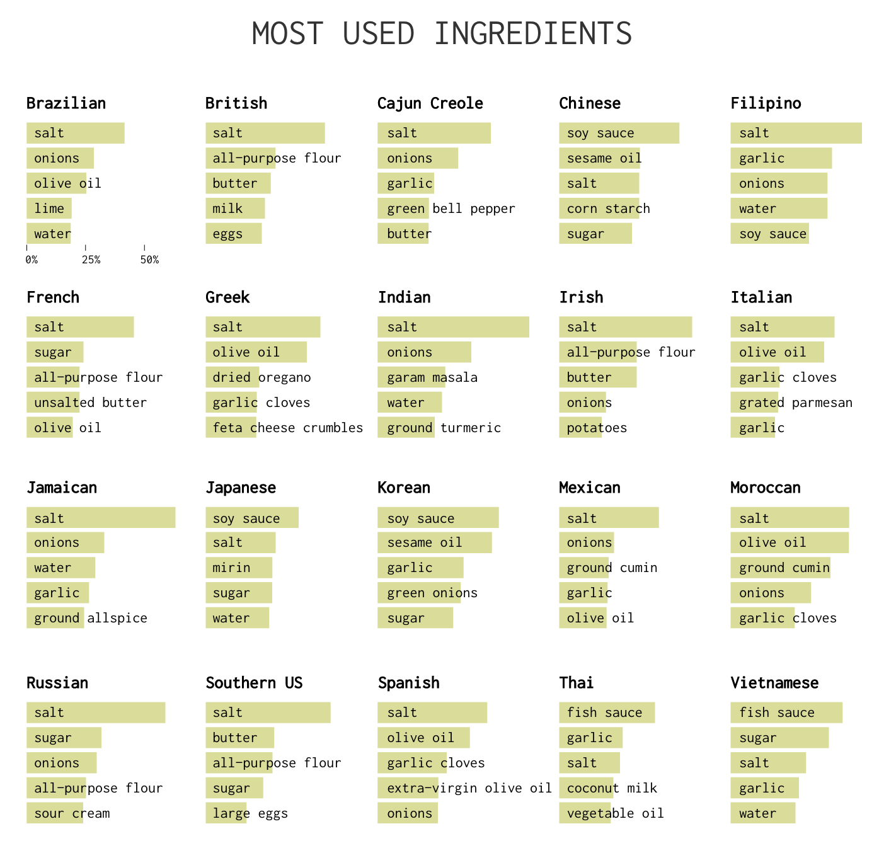
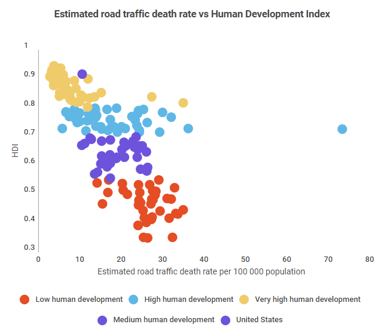
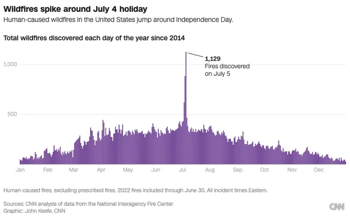
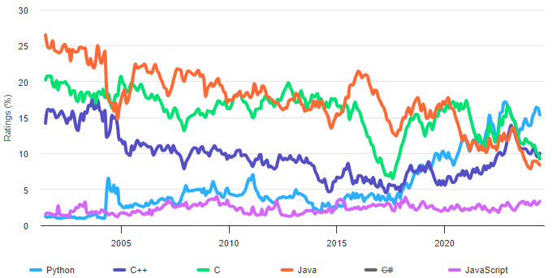
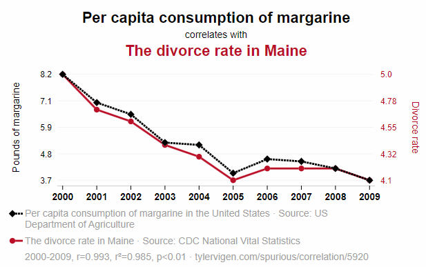
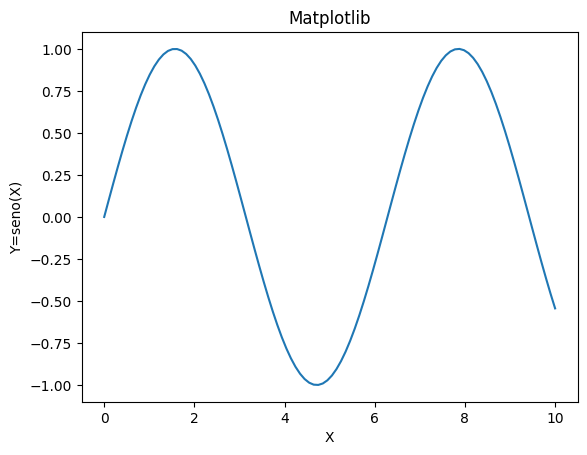
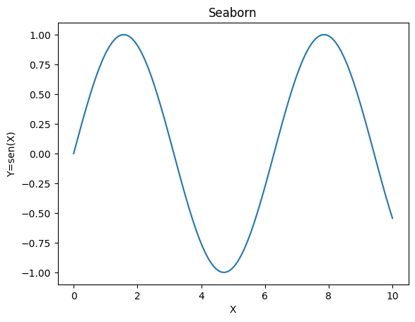
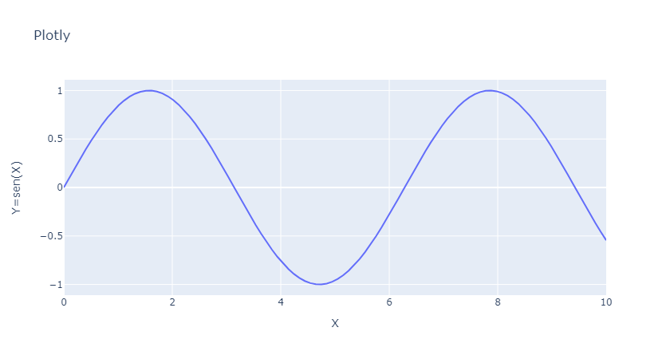
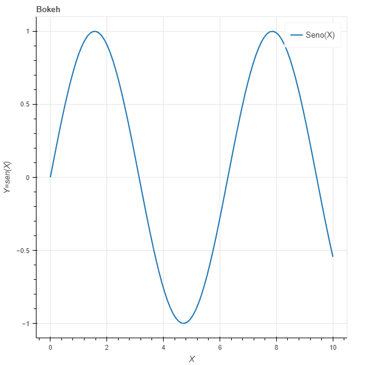
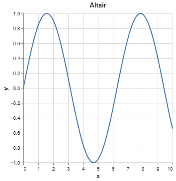

# Visualização de Dados

<p class ='small'>Albert E.F. Muritiba</p>


<!--_footer: ' '-->

---

 A visualização de dados é uma forma de comunicação que usa representações visuais para explorar, interpretar e apresentar dados.
 --

 ---

## Por que visualizar dados?

- Facilita a **compreensão** dos dados
- Facilita a identificação de **padrões**
- Facilita a identificação de **outliers**
- Facilita a identificação de **tendências**
- Facilita a identificação de **relações** entre variáveis
- Facilita a identificação de percepções (**insights**)

---

### Ingredientes culinários

  - Qual é o mais utilizado no Brasil?
  - e em outros países?
  - Onde se usa mais azeite de oliva?
  - O que a Jamaica e a Índia têm em comum?
  - [fonte](https://www.juiceanalytics.com/writing/20-best-examples-of-charts-and-graphs)


<!-- _footer: '' -->

---

### Mortes x IDH

- Algum país se destaca? <div class='small'>(Líbia)</div>
- Existe alguma relação entre as mortes e o IDH?
- Existe uma faixa de IDH com mais mortes?

- [fonte](https://infogram.com/blog/infogram-insights-dangerous-driving/)



---

### Incêndios Florestais EUA

- Existem meses com mais incêndios?
- Quais?
- Tem algum *outlier*? 
- Qual seria a explicação para esse *outlier*?
- [fonte](https://policyviz.com/2022/10/24/break-the-frame-an-approach-to-visualizing-outliers/)




---

### Popularidade de Linguagens de Programação

- Qual a linguagem mais popular?
- Alguma está crescendo?
- Alguma está em declínio?
- [fonte](https://www.tiobe.com/tiobe-index/)




---

### Divórcios x Margarina

- O que o consumo de margarina tem a ver com o número de divórcios?
- [fonte](https://www.tylervigen.com/spurious-correlations)



---

## Insights
Observe o gráfico abaixo. O que você consegue perceber?

<!-- coloque o gráfico aqui -->

---
s
## Ferramentas de Visualização em Python
<!-- link para o doc das libs -->
[Matplotlib](https://matplotlib.org/), [Seaborn](https://seaborn.pydata.org/), [Plotly](https://plotly.com/), [Bokeh](https://docs.bokeh.org/en/latest/index.html), [Altair](https://altair-viz.github.io/), [Plotnine](https://plotnine.readthedocs.io/en/stable/), [Geopandas](https://geopandas.org/), [Folium](https://python-visualization.github.io/folium/), [Wordcloud](https://amueller.github.io/word_cloud/), [Networkx](https://networkx.org/), [Pydot](https://pydotplus.readthedocs.io/), [Graphviz](https://graphviz.org/), entre outras.

---


## 1. Matplotlib


- **Descrição**: Biblioteca de visualização de dados mais antiga e amplamente utilizada.
- **Características**:
  - Suporte para gráficos 2D e 3D.
  - Altamente flexível e personalizável.
  - Base para outras bibliotecas como Seaborn e Pandas.


---
### Exemplo Matplotlib

```python
import matplotlib.pyplot as plt
import numpy as np

x = np.linspace(0, 10, 100)
y = np.sin(x)

plt.plot(x, y)
plt.xlabel('X')
plt.ylabel('Y=seno(X)')
plt.title('Matplotlib')
plt.show()
```



---

## 2. Seaborn


- **Descrição**: Construída sobre Matplotlib, oferece uma interface de alto nível para gráficos estatísticos.
- **Características**:
  - Estilização predefinida de gráficos.
  - Facilidade para criar gráficos complexos.
  - Integração fácil com DataFrames do Pandas.

---

### Exemplo Seaborn

```python
import seaborn as sns
import matplotlib.pyplot as plt
x = np.linspace(0, 10, 100)
y = np.sin(x)
# Dados
data = {'x': x, 'y': y}

# Criação do gráfico
sns.lineplot(x='x', y='y', data=data)
plt.xlabel('X')
plt.ylabel('Y=sen(X)')
plt.title('Seaborn')
plt.show()
```



---

## 3. Plotly


- **Descrição**: Biblioteca de gráficos interativos para visualizações complexas.
- **Características**:
  - Gráficos interativos e personalizáveis.
  - Suporte para gráficos 3D e mapas.
  - Integração com frameworks web como Dash.

---

### Exemplo Plotly

```python
import plotly.express as px
import numpy as np

x = np.linspace(0, 10, 100)
y = np.sin(x)

fig = px.line(x=x, y=y, title='Plotly')
fig.show()
```



---

## 4. Bokeh


- **Descrição**: Biblioteca de visualização interativa para gráficos elegantes e concisos.
- **Características**:
  - Gráficos interativos e responsivos.
  - Integração com notebooks Jupyter.
  - Suporte para gráficos em tempo real.

---

### Exemplo Bokeh

```python
from bokeh.plotting import figure, show
import numpy as np

x = np.linspace(0, 10, 100)
y = np.sin(x)

p = figure(title='Bokeh', x_axis_label='X', y_axis_label='Y=sen(X)')
p.line(x, y, legend_label='Seno(X)', line_width=2)
show(p)
```



---


## 5. Altair


- **Descrição**: Biblioteca declarativa para gráficos estatísticos, baseada na linguagem Vega-Lite.
- **Características**:
  - Sintaxe declarativa simples.
  - Integração com DataFrames do Pandas.
  - Suporte para visualizações interativas.

---

## Exemplo Altair

```python
import altair as alt
import numpy as np
import pandas as pd

x = np.linspace(0, 10, 100)
y = np.sin(x)
data = pd.DataFrame({'x': x, 'y': y})

alt.Chart(data).mark_line().encode(
    x='x',
    y='y'
).properties(
    title='Altair'
)
```



---

Neste curso, vamos focar na utilização da biblioteca **Matplotlib**. Por ser a mais antiga e amplamente utilizada, é importante conhecer seus recursos e funcionalidades.

---
## Matplotlib

---

### Figuras e Eixos


- A **figura** é a área total onde o gráfico será desenhado. Em Matplotlib, a figura é representada pelo objeto Figure.
O que são Eixos?

- Os **eixos** são a área onde os dados são plotados. Eles representam o sistema de coordenadas do gráfico. 

```python
import matplotlib.pyplot as plt
fig, ax = plt.subplots()
```

> `subplots()` é uma função que cria uma nova figura e um novo conjunto de eixos. 

---

### Elementos Básicos de um Gráfico

- **Título**: Título do gráfico.
```python
ax.set_title('Título')
```

- **Rótulos dos Eixos**: Rótulos dos eixos x e y.
```python
ax.set_xlabel('Eixo X')
ax.set_ylabel('Eixo Y')
```

- **Legenda**: Legenda do gráfico.
```python
ax.legend(['Série 1', 'Série 2'])
```

- **Grade**: Linhas de grade no gráfico.
```python
ax.grid(True)
```

---

### Tipos de Gráficos

- **Gráfico de Linhas**: Gráfico que exibe a relação entre duas variáveis.
```python
ax.plot([1, 2, 3, 4], [10, 20, 25, 30])
```
> Um gráfico de linha é adequado para exibir dados ordenados e contínuos, ou seja, se supõe que haja valores intermediários entre os pontos.

---

#### Principais Parâmetros

  - `x`: Valores do eixo x.
  - `y`: Valores do eixo y.
  - `label`: Rótulo da série.
  - `color`: Cor da linha.
  - `linestyle`: Estilo da linha.
  - `linewidth`: Largura da linha.
  - `marker`: Marcador dos pontos.

[saiba mais](https://matplotlib.org/stable/api/_as_gen/matplotlib.pyplot.plot.html)

---

- Os valore x/y podem ser listas, arrays, séries ou DataFrames do Pandas.
- A cor da linha pode ser especificada por nome ou código hexadecimal. Ex: 'red', '#FF0000'.
- O estilo da linha pode ser sólido ('-'), tracejado ('--'), [outros](https://matplotlib.org/stable/gallery/lines_bars_and_markers/linestyles.html).
- O marcador dos pontos pode ser 'o' (círculo), 's' (quadrado), '^' (triângulo), [outros](https://matplotlib.org/stable/api/markers_api.html).
  
---

#### Exemplo Gráfico de Linhas

```python
import matplotlib.pyplot as plt
import numpy as np

x = np.linspace(0, 10, 100)
y = np.sin(x)

fig, ax = plt.subplots()
ax.plot(x, y, label='Seno(X)', color='blue', linestyle='--', linewidth=2, marker='o')
ax.set_title('Gráfico de Linhas')
ax.set_xlabel('X')
ax.set_ylabel('Y=sen(X)')
ax.legend()
plt.show()
```

---
### Gráfico de linhas com mais de uma série

```python
import matplotlib.pyplot as plt
import numpy as np

x = np.linspace(0, 10, 100)
y1 = np.sin(x)
y2 = np.cos(x)

fig, ax = plt.subplots()
ax.plot(x, y1, label='Seno(X)', color='blue', linestyle='--', linewidth=2, marker='o')
ax.plot(x, y2, label='Cosseno(X)', color='red', linestyle='-', linewidth=2, marker='s')
ax.set_title('Gráfico de Linhas')
ax.set_xlabel('X')
ax.set_ylabel('Y')
ax.legend()
plt.show()
```

---

### Gráfico de Barras

- **Gráfico de Barras**: Gráfico que exibe a comparação entre diferentes categorias.
```python
ax.bar(['A', 'B', 'C', 'D'], [10, 20, 15, 30])
```
> Um gráfico de barras é adequado para exibir dados categóricos ou discretos.

---

#### Principais Parâmetros

  - `x`: Categorias.
  - `height`: Altura das barras.
  - `color`: Cor das barras.
  - `edgecolor`: Cor da borda das barras.
  - `linewidth`: Largura da borda das barras.
  - `label`: Rótulo da série.
  - `align`: Alinhamento das barras.

[saiba mais](https://matplotlib.org/stable/api/_as_gen/matplotlib.pyplot.bar.html)  

---

- As categorias x podem ser listas, arrays, séries ou DataFrames do Pandas.
- A cor das barras pode ser uniforme ou variável. Ex: 'blue', ['blue', 'red', 'green'].
- A largura das barras é definida automaticamente, mas pode ser ajustada.

---

#### Exemplo Gráfico de Barras

```python
import matplotlib.pyplot as plt

categorias = ['A', 'B', 'C', 'D']
valores = [10, 20, 15, 30]
cores = ['blue', 'red', 'green', 'orange']

fig, ax = plt.subplots()
ax.bar(categorias, valores, color=cores, 
        edgecolor='black', linewidth=1, label='Valores')
ax.set_title('Gráfico de Barras')
ax.set_xlabel('Categorias')
ax.set_ylabel('Valores')
ax.legend()
plt.show()
```

---

### Gráfico de Barras Horizontais

- **Gráfico de Barras Horizontais**: Gráfico de barras com as categorias no eixo y.
```python
ax.barh(['A', 'B', 'C', 'D'], [10, 20, 15, 30])
```
> Tem a mesma finalidade do gráfico de barras, mas com as categorias no eixo y. Pode ser útil para exibir muitas categorias.

---

#### Exemplo Gráfico de Barras Horizontais

```python
import matplotlib.pyplot as plt

categorias = ['A', 'B', 'C', 'D']
valores = [10, 20, 15, 30]
cores = ['blue', 'red', 'green', 'orange']

fig, ax = plt.subplots()
ax.barh(categorias, valores, color=cores, 
        edgecolor='black', linewidth=1, label='Valores')
ax.set_title('Gráfico de Barras Horizontais')
ax.set_xlabel('Valores')
ax.set_ylabel('Categorias')
ax.legend()
plt.show()
```

---

### Gráfico de Pizza

- **Gráfico de Pizza**: Gráfico circular que exibe a proporção de cada categoria.
```python
ax.pie([10, 20, 15, 30], labels=['A', 'B', 'C', 'D'])
```
> Um gráfico de pizza é adequado para exibir a distribuição de categorias **em um todo**, ou seja, a proporção de cada categoria em relação ao total.

---

#### Principais Parâmetros

  - `x`: Valores das categorias.
  - `labels`: Rótulos das categorias.
  - `colors`: Cores das categorias.
  - `explode`: Destaque de uma ou mais categorias.
  - `autopct`: Formato dos percentuais.
  - `shadow`: Sombra do gráfico.
  
[saiba mais](https://matplotlib.org/stable/api/_as_gen/matplotlib.pyplot.pie.html)

---

- O destaque de uma ou mais categorias é feito por meio de uma lista de valores.
- O formato dos percentuais pode ser uma string de formatação. Ex: '%.1f%%'.

---

#### Exemplo Gráfico de Pizza

```python
import matplotlib.pyplot as plt

valores = [10, 20, 15, 30]
categorias = ['A', 'B', 'C', 'D']
cores = ['blue', 'red', 'green', 'orange']
destaque = (0, 0, 0.1, 0)

fig, ax = plt.subplots()
ax.pie(valores, labels=categorias, colors=cores, 
        explode=destaque, autopct='%.1f%%', shadow=True)
ax.set_title('Gráfico de Pizza')
plt.show()
```

---

### Gráfico de Dispersão

- **Gráfico de Dispersão**: Gráfico que exibe a relação entre duas variáveis.
```python
ax.scatter([1, 2, 3, 4], [10, 20, 15, 30])
```
> Um gráfico de dispersão é adequado para exibir a relação entre duas variáveis contínuas, onde não se supõe que haja qualquer função entre elas.

---

#### Principais Parâmetros

  - `x`: Valores do eixo x.
  - `y`: Valores do eixo y.
  - `s`: Tamanho dos pontos.
  - `c`: Cor dos pontos.
  - `marker`: Marcador dos pontos.
  - `alpha`: Transparência dos pontos.
  - `label`: Rótulo da série.
  - `cmap`: Mapa de cores.
  
[saiba mais](https://matplotlib.org/stable/api/_as_gen/matplotlib.pyplot.scatter.html)

---

- Os valores x/y podem ser listas, arrays, séries ou DataFrames do Pandas.
- O tamanho dos pontos pode ser uniforme ou variável. Ex: 100, [10, 20, 30].
- A cor dos pontos pode ser uniforme ou variável. Ex: 'blue', ['blue', 'red', 'green'].
- O marcador dos pontos pode ser 'o' (círculo), 's' (quadrado), '^' (triângulo), [outros](https://matplotlib.org/stable/api/markers_api.html).
- A transparência dos pontos varia de 0 (transparente) a 1 (opaco).
- O mapa de cores é uma paleta de cores. Ex: 'viridis', 'plasma', 'inferno', 'magma'.
- A paleta de cores é útil para representar uma terceira variável.

---

#### Exemplo Gráfico de Dispersão

```python
import matplotlib.pyplot as plt

x = [1, 2, 3, 4]
y = [10, 20, 15, 30]
tamanhos = [100, 200, 300, 400]
cores = [0.1, 0.5, 0.9, 1]

fig, ax = plt.subplots()
ax.scatter(x, y, s=tamanhos, c=cores, cmap='viridis', alpha=0.5, label='Pontos')
ax.set_title('Gráfico de Dispersão')
ax.set_xlabel('X')
ax.set_ylabel('Y')
ax.legend()
plt.show()
```

---

### Gráfico de Histograma

- **Gráfico de Histograma**: Gráfico que exibe a distribuição de uma variável contínua.
```python
ax.hist([1, 2, 2, 3, 3, 3, 4, 4, 4, 4])
```
> Um gráfico de histograma é adequado para exibir a distribuição de uma variável contínua em intervalos.
> A altura das barras representa a frequência dos valores.

---

#### Principais Parâmetros

  - `x`: Valores da variável.
  - `bins`: Número de intervalos.
  - `range`: Intervalo dos valores.
  - `color`: Cor das barras.
  - `edgecolor`: Cor da borda das barras.
  - `linewidth`: Largura da borda das barras.
  - `label`: Rótulo da série.
  - `density`: Densidade das barras.

[saiba mais](https://matplotlib.org/stable/api/_as_gen/matplotlib.pyplot.hist.html)

---

- Os valores x podem ser listas, arrays, séries ou DataFrames do Pandas.
- O número de intervalos é definido automaticamente, mas pode ser ajustado.
- A cor das barras pode ser uniforme ou variável. Ex: 'blue', ['blue', 'red', 'green'].
- A largura das barras é definida automaticamente, mas pode ser ajustada.
- A densidade das barras é a proporção de valores em cada intervalo.

---

#### Exemplo Gráfico de Histograma

```python
import matplotlib.pyplot as plt

valores = [1, 2, 2, 3, 3, 3, 4, 4, 4, 4]
intervalos = 4
cores = ['blue', 'red', 'green', 'orange']

fig, ax = plt.subplots()
ax.hist(valores, bins=intervalos, color=cores, 
        edgecolor='black', linewidth=1, label='Valores', density=True)
ax.set_title('Gráfico de Histograma')
ax.set_xlabel('Valores')
ax.set_ylabel('Densidade')
ax.legend()
plt.show()
```

---

### Gráfico de Boxplot

- **Gráfico de Boxplot**: Gráfico que exibe a distribuição de uma variável contínua.
```python
ax.boxplot([1, 2, 2, 3, 3, 3, 4, 4, 4, 4])
```
> Um gráfico de boxplot é adequado para exibir a distribuição de uma variável contínua em quartis.

---

#### Principais Parâmetros

  - `x`: Valores da variável.
  - `vert`: Orientação do boxplot.
  - `patch_artist`: Estilo do boxplot.
  - `notch`: Intervalo de confiança.
  - `showmeans`: Média dos valores.
  - `showfliers`: Outliers.
  - `showcaps`: Extremidades dos whiskers.
  - `showbox`: Caixa do boxplot.
  
[saiba mais](https://matplotlib.org/stable/api/_as_gen/matplotlib.pyplot.boxplot.html)

---

- Os valores x podem ser listas, arrays, séries ou DataFrames do Pandas.
- A orientação do boxplot pode ser vertical ('vert') ou horizontal ('horiz').
- O estilo do boxplot pode ser simples ou colorido.
- O intervalo de confiança é uma linha que indica a incerteza da mediana.
- A média dos valores é uma linha que indica a média dos valores.
- Os outliers são valores que estão fora dos limites dos whiskers.
- As extremidades dos whiskers são os valores mínimo e máximo.
- A caixa do boxplot é a região entre o primeiro e terceiro quartis.

---

#### Exemplo Gráfico de Boxplot

```python
import matplotlib.pyplot as plt

valores = [1, 2, 2, 3, 3, 3, 4, 4, 4, 4]

fig, ax = plt.subplots()
ax.boxplot(valores, vert=False, patch_artist=True, notch=True, 
            showmeans=True, showfliers=True, showcaps=True, showbox=True)
ax.set_title('Gráfico de Boxplot')
ax.set_xlabel('Valores')
plt.show()
```

---

