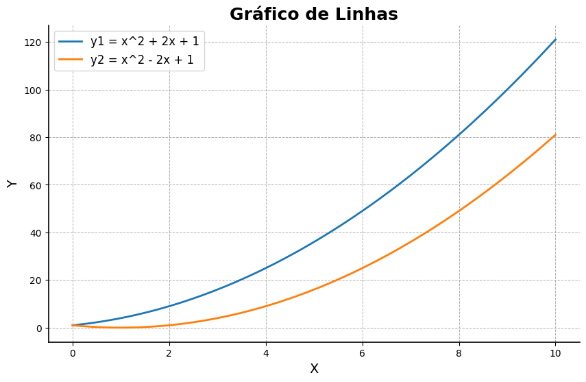
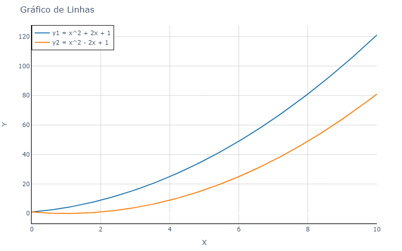

# Visualização de Dados

<p class ='small'>Albert E.F. Muritiba</p>


<!--_footer: ' '-->

---

 A visualização de dados é uma forma de comunicação que usa representações visuais para explorar, interpretar e apresentar dados.
 --

 ---

## Por que visualizar dados?

- Facilita a **compreensão** dos dados
- Facilita a identificação de **padrões**
- Facilita a identificação de **outliers**
- Facilita a identificação de **tendências**
- Facilita a identificação de **relações** entre variáveis
- Facilita a identificação de percepções (**insights**)

---

## Compreeensão
Observe o gráfico abaixo. O que você consegue perceber?

<!-- coloque o gráfico aqui -->

---
## Padrões
Observe o gráfico abaixo. O que você consegue perceber?

<!-- coloque o gráfico aqui -->

---

## Outliers
Observe o gráfico abaixo. O que você consegue perceber?

<!-- coloque o gráfico aqui -->

---

## Tendências
Observe o gráfico abaixo. O que você consegue perceber?

<!-- coloque o gráfico aqui -->

---

## Relações
Observe o gráfico abaixo. O que você consegue perceber?

<!-- coloque o gráfico aqui -->

---

## Insights
Observe o gráfico abaixo. O que você consegue perceber?

<!-- coloque o gráfico aqui -->

---
s
## Ferramentas de Visualização em Python
<!-- link para o doc das libs -->
[Matplotlib](https://matplotlib.org/), [Seaborn](https://seaborn.pydata.org/), [Plotly](https://plotly.com/), [Bokeh](https://docs.bokeh.org/en/latest/index.html), [Altair](https://altair-viz.github.io/), [Plotnine](https://plotnine.readthedocs.io/en/stable/), [Geopandas](https://geopandas.org/), [Folium](https://python-visualization.github.io/folium/), [Wordcloud](https://amueller.github.io/word_cloud/), [Networkx](https://networkx.org/), [Pydot](https://pydotplus.readthedocs.io/), [Graphviz](https://graphviz.org/), entre outras.

---


## 1. Matplotlib


- **Descrição**: Biblioteca de visualização de dados mais antiga e amplamente utilizada.
- **Características**:
  - Suporte para gráficos 2D e 3D.
  - Altamente flexível e personalizável.
  - Base para outras bibliotecas como Seaborn e Pandas.


---
### Exemplo Matplotlib

```python
import matplotlib.pyplot as plt
import numpy as np

x = np.linspace(0, 10, 100)
y = np.sin(x)

plt.plot(x, y)
plt.xlabel('X')
plt.ylabel('Y=seno(X)')
plt.title('Matplotlib')
plt.show()
```


---

## 2. Seaborn


- **Descrição**: Construída sobre Matplotlib, oferece uma interface de alto nível para gráficos estatísticos.
- **Características**:
  - Estilização predefinida de gráficos.
  - Facilidade para criar gráficos complexos.
  - Integração fácil com DataFrames do Pandas.

---

### Exemplo Seaborn

```python
import seaborn as sns
import matplotlib.pyplot as plt
x = np.linspace(0, 10, 100)
y = np.sin(x)
# Dados
data = {'x': x, 'y': y}

# Criação do gráfico
sns.lineplot(x='x', y='y', data=data)
plt.xlabel('X')
plt.ylabel('Y=sen(X)')
plt.title('Seaborn')
plt.show()
```


---

## 3. Plotly


- **Descrição**: Biblioteca de gráficos interativos para visualizações complexas.
- **Características**:
  - Gráficos interativos e personalizáveis.
  - Suporte para gráficos 3D e mapas.
  - Integração com frameworks web como Dash.

---

### Exemplo Plotly

```python
import plotly.express as px
import numpy as np

x = np.linspace(0, 10, 100)
y = np.sin(x)

fig = px.line(x=x, y=y, title='Plotly')
fig.show()
```


---

## 4. Bokeh


- **Descrição**: Biblioteca de visualização interativa para gráficos elegantes e concisos.
- **Características**:
  - Gráficos interativos e responsivos.
  - Integração com notebooks Jupyter.
  - Suporte para gráficos em tempo real.

---

### Exemplo Bokeh

```python
from bokeh.plotting import figure, show
import numpy as np

x = np.linspace(0, 10, 100)
y = np.sin(x)

p = figure(title='Bokeh', x_axis_label='X', y_axis_label='Y=sen(X)')
p.line(x, y, legend_label='Seno(X)', line_width=2)
show(p)
```


---


## 5. Altair


- **Descrição**: Biblioteca declarativa para gráficos estatísticos, baseada na linguagem Vega-Lite.
- **Características**:
  - Sintaxe declarativa simples.
  - Integração com DataFrames do Pandas.
  - Suporte para visualizações interativas.

---

## Exemplo Altair

```python
import altair as alt
import numpy as np
import pandas as pd

x = np.linspace(0, 10, 100)
y = np.sin(x)
data = pd.DataFrame({'x': x, 'y': y})

alt.Chart(data).mark_line().encode(
    x='x',
    y='y'
).properties(
    title='Altair'
)
```


---

Neste curso, vamos explorar as principais bibliotecas de visualização de dados em Python, com foco em **Matplotlib** e **Plotly**.

- **Matplotlib**: Para gráficos estáticos e personalizáveis.
- **Plotly**: Para gráficos interativos e responsivos.

---
## Tipos de Gráficos

---

### Gráficos de Linha

- Representam a relação entre duas variáveis **contínuas**.
- **Não** devem ser usados para representar variáveis **categóricas**.
- **Exemplos**: séries temporais, funções matemáticas.



---

```python
import matplotlib.pyplot as plt
import numpy as np

# Dados
x = np.linspace(0, 10, 100)
y1 = x**2 + 2*x + 1
y2 = x**2 - 2*x + 1

# Configuração do estilo
plt.style.use('default')

# Criar o gráfico
fig, ax = plt.subplots(figsize=(10, 6))

# Plotar as séries
ax.plot(x, y1, label='y1 = x^2 + 2x + 1', color='#1f77b4', linewidth=2.0)
ax.plot(x, y2, label='y2 = x^2 - 2x + 1', color='#ff7f0e', linewidth=2.0)

# Título e legendas
ax.set_title('Gráfico de Linhas', fontsize=18, fontweight='bold')
ax.set_xlabel('X', fontsize=14)
ax.set_ylabel('Y', fontsize=14)

# Exibir a legenda
ax.legend(fontsize=12)

# Linha de grade
ax.grid(True, which='both', linestyle='--', linewidth=0.7)

# Personalização dos eixos
ax.spines['top'].set_visible(False)
ax.spines['right'].set_visible(False)
ax.spines['left'].set_linewidth(1.2)
ax.spines['bottom'].set_linewidth(1.2)

# Mostrar o gráfico
plt.show()
```


---

```python
import plotly.graph_objects as go
import numpy as np

# Dados
x = np.linspace(0, 10, 100)
y1 = x**2 + 2*x + 1
y2 = x**2 - 2*x + 1

# Criar figuras e traços
fig = go.Figure()

# Adicionar traços
fig.add_trace(go.Scatter(x=x, y=y1, mode='lines', name='y1 = x^2 + 2x + 1', line=dict(color='#1f77b4', width=2)))
fig.add_trace(go.Scatter(x=x, y=y2, mode='lines', name='y2 = x^2 - 2x + 1', line=dict(color='#ff7f0e', width=2)))

# Layout
fig.update_layout(
    title='Gráfico de Linhas',
    xaxis=dict(title='X', linewidth=1.2, linecolor='black'),
    yaxis=dict(title='Y', linewidth=1.2, linecolor='black'),
    legend=dict(font=dict(size=12), xanchor='left', yanchor='top', x=0, y=1, bordercolor='black', borderwidth=1),
    plot_bgcolor='rgba(0,0,0,0)',
    xaxis_showgrid=True,
    yaxis_showgrid=True,
    xaxis_gridcolor='lightgrey',
    yaxis_gridcolor='lightgrey',
    showlegend=True,
    width=800,
    height=500,
    margin=dict(l=50, r=50, b=50, t=50),    
)

# Mostrar o gráfico
fig.show()
```



---

### Escala 

- **Linear**: Escala padrão, onde os valores são distribuídos uniformemente.
- **Logarítmica**: Escala usada para representar valores muito grandes ou muito pequenos.
```python
# ...
ax.set_yscale('log')
# ...
```


